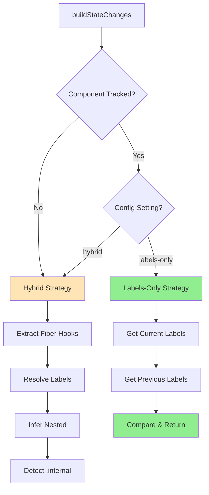

# Labels-Only State Resolution Strategy

**Status**: Design Document
**Created**: 2025-11-28
**Author**: System Analysis
**Target Package**: `@autotracer/react18`

---

## Problem Statement

### Current Behavior: The "Hybrid" Approach

The current state resolution system attempts to be intelligent by **matching labels against fiber hooks**:

1. Extract all hooks from the flat fiber `memoizedState` chain
2. Try to match each fiber hook to a registered label using value-based matching
3. Apply heuristics to infer nested hook labels (e.g., `customHook.value`)
4. Label unmatched non-primitive hooks as `{container}.internal`
5. Leave unmatched primitives as `unknown`

**Fundamental Problem**: React flattens all hooks (component + custom hook internals) into a single linked list. We have **no structural information** about which hooks belong to which custom hook.

### Issues with the Hybrid Approach

#### 1. **Ambiguous `.internal` Labels**

```typescript
const useForm = () => {
  const [internal1] = useState({});  // React queue object
  const [internal2] = useState(null);
  return { formState: {...}, register: fn };
};

// Component
const form = useForm();  // Labeled as "form"
```

**Output**:

- `form: {...}` ✅ Correct
- `form.internal: {}` ⚠️ Ambiguous - is this intentional or React internals?
- `unknown: null` ⚠️ Lost - could be important state

#### 2. **Excessive `unknown` Primitives**

Primitives (strings, numbers, booleans) remain `unknown` because the heuristic only applies `.internal` to **non-primitives**. This creates noise and loses potentially important state.

#### 3. **Stable Reference Bug**

```typescript
const formHook = useForm(); // Returns SAME object reference every render
// Internal properties change: { isReady: false } → { isReady: true }
```

The hybrid approach filters out `formHook` because `prevValue === value` (same reference), even though the object's properties changed. The "unmatched labels" fallback catches it, but this is fragile.

#### 4. **Violates Ground Truth Principle**

**The entire point of labeling** (via `labelState()` or injection) is to provide **authoritative information** about component state. The hybrid approach **discards this ground truth** and tries to reverse-engineer it from ambiguous fiber internals.

#### 5. **Complexity Explosion**

The hybrid approach requires:

- `extractUseStateValues` - walk fiber hook chain
- `resolveHookLabel` - match fiber hooks to labels
- `inferNestedHookLabels` - 3-pass recursive inference with getter detection
- `detectIndexConflict` - check for `.internal` suffix
- Complex matching strategies (ordinal, constraints, structural)

**Result**: 400+ lines of heuristics that still produce ambiguous output.

---

## Proposed Solution: Labels-Only Strategy

### Core Principle

**For tracked components, labels ARE the ground truth. Use them directly.**

### Architecture



### Implementation Strategy

**Factory Pattern** - zero changes to existing code:

```typescript
/**
 * Factory: Creates state changes builder based on resolution strategy.
 * Pure function - returns strategy implementation without side effects.
 */
function createStateChangesBuilder(
  strategy: "hybrid" | "labels-only"
): StateChangesBuilder {
  return strategy === "labels-only"
    ? createLabelsOnlyBuilder()
    : createHybridBuilder(); // Existing implementation - UNTOUCHED
}

interface StateChangesBuilder {
  build(
    isNewMount: boolean,
    trackingGUID: string | null,
    useStateValues: UseStateValueEntry[],
    anchors: readonly Hook[],
    allAnchors: AnchorEntry[]
  ): StateChangeEntry[];
}
```

### New Configuration Option

```typescript
interface ReactTracerOptions {
  // ... existing options ...

  /**
   * State resolution strategy for tracked components.
   *
   * - **"hybrid"** (default): Match labels against fiber hooks with inference
   *   - Uses both labeled state AND fiber traversal
   *   - Applies heuristics to infer nested hooks and detect .internal
   *   - More information but may include ambiguous unknowns
   *   - Backward compatible with existing behavior
   *
   * - **"labels-only"**: Use only explicitly labeled state
   *   - Ignores fiber hooks entirely for tracked components
   *   - No unknowns, no .internal, no heuristics
   *   - Cleaner output, guaranteed accuracy
   *   - Best for production apps with complete labeling
   *
   * **Untracked components** always use fiber-based resolution regardless of this setting.
   *
   * @default "hybrid"
   */
  trackedStateResolution?: "hybrid" | "labels-only";
}
```

---

## Detailed Design

### Labels-Only Builder

#### Mount Strategy

```typescript
/**
 * Builds state changes for tracked component mount using labels only.
 * Pure function - reads from registry, no side effects.
 */
function buildLabelsOnlyMountStateChanges(
  trackingGUID: string
): StateChangeEntry[] {
  const currentLabels = getLabelsForGuid(trackingGUID);

  return currentLabels.map(({ label, value }) => ({
    name: label,
    value,
    prevValue: undefined,
    hook: null, // No fiber reference needed
    isIdenticalValueChange: false,
  }));
}
```

**Key Points**:

- ✅ Single responsibility: map labels to state changes
- ✅ ≤3 parameters: just `trackingGUID`
- ✅ Pure function: no side effects
- ✅ No mode switches
- ✅ Independently testable

#### Update Strategy

```typescript
/**
 * Builds state changes for tracked component update using labels only.
 * Pure function - reads from registry, no side effects.
 */
function buildLabelsOnlyUpdateStateChanges(
  trackingGUID: string
): StateChangeEntry[] {
  const currentLabels = getLabelsForGuid(trackingGUID);
  const prevLabels = getPrevLabelsForGuid(trackingGUID);

  const prevValueMap = buildPrevValueMap(prevLabels);

  return currentLabels
    .map(({ label, value }) =>
      createLabelChangeEntry(label, value, prevValueMap)
    )
    .filter((entry): entry is StateChangeEntry => entry !== null);
}

/**
 * Builds a map of previous label values for quick lookup.
 * Pure function - no side effects.
 */
function buildPrevValueMap(
  prevLabels: readonly LabelEntry[]
): ReadonlyMap<string, unknown> {
  return new Map(prevLabels.map(({ label, value }) => [label, value]));
}

/**
 * Creates state change entry if value actually changed.
 * Pure function - no side effects.
 */
function createLabelChangeEntry(
  label: string,
  value: unknown,
  prevValueMap: ReadonlyMap<string, unknown>
): StateChangeEntry | null {
  const prevValue = prevValueMap.get(label);

  // Skip if no previous value (new label)
  if (prevValue === undefined) return null;

  // Skip if value unchanged
  if (prevValue === value) return null;

  const isIdenticalValueChange = detectIdenticalValueChange(prevValue, value);

  return {
    name: label,
    value,
    prevValue,
    hook: null,
    isIdenticalValueChange,
  };
}
```

**Key Points**:

- ✅ Each function has single responsibility
- ✅ All functions are pure
- ✅ No fiber traversal
- ✅ No heuristics
- ✅ Pipeline clarity: map → filter with meaningful steps

### Hybrid Builder (Existing Code - Wrapped)

```typescript
/**
 * Builds state changes using hybrid fiber + labels strategy.
 * Wraps existing implementation without modification.
 */
function buildHybridStateChanges(
  isNewMount: boolean,
  trackingGUID: string | null,
  useStateValues: UseStateValueEntry[],
  anchors: readonly Hook[],
  allAnchors: AnchorEntry[]
): StateChangeEntry[] {
  // Existing buildStateChanges implementation
  // COMPLETELY UNTOUCHED - just wrapped for factory pattern
  return buildStateChanges(
    isNewMount,
    useStateValues,
    anchors,
    allAnchors,
    trackingGUID
  );
}
```

### Integration Point

```typescript
// In buildTreeNode.ts
export function buildTreeNode(
  fiberNode: FiberNode | null,
  depth: number
): TreeNode {
  // ... existing code ...

  const trackingGUID = getTrackingGUID(fiberNode);

  // Get configuration
  const options = getCurrentOptions();
  const strategy = options.trackedStateResolution ?? "hybrid";

  // Create builder via factory
  const builder = createStateChangesBuilder(strategy);

  // For tracked components, builder decides whether to use fibers
  const stateChanges = trackingGUID
    ? builder.buildTracked(isNewMount, trackingGUID)
    : builder.buildUntracked(
        isNewMount,
        extractUseStateValues(fiberNode),
        anchors,
        allAnchors
      );

  // ... rest of existing code ...
}
```

---

## File Structure

Following project rules: one export per file, concern-based grouping.

```
src/lib/functions/treeProcessing/building/helpers/
├── buildStateChanges.ts                    # Factory function
├── buildStateChanges/
│   ├── strategies/
│   │   ├── StateChangesBuilder.ts          # Interface
│   │   ├── createLabelsOnlyBuilder.ts      # Factory for labels-only
│   │   ├── createHybridBuilder.ts          # Factory for hybrid (wraps existing)
│   │   ├── labelsOnly/
│   │   │   ├── buildLabelsOnlyMountStateChanges.ts
│   │   │   ├── buildLabelsOnlyUpdateStateChanges.ts
│   │   │   ├── buildPrevValueMap.ts
│   │   │   └── createLabelChangeEntry.ts
│   │   └── hybrid/
│   │       └── buildHybridStateChanges.ts  # Thin wrapper
│   ├── buildMountStateChanges.ts           # Existing - UNTOUCHED
│   ├── buildUpdateStateChanges.ts          # Existing - UNTOUCHED
│   └── ... (all other existing files)
```

---

## Benefits

### 1. **Eliminates Ambiguity for Tracked Components**

- No `.internal` labels
- No `unknown` primitives
- Clean, predictable output

### 2. **Fixes Stable Reference Bug**

```typescript
// Before (hybrid):
const form = useForm(); // Same reference, filtered out
// Unmatched labels catches it - fragile!

// After (labels-only):
const form = useForm(); // Direct label comparison - always works
```

### 3. **Dramatically Simpler**

- **Hybrid**: 400+ lines of heuristics across 10+ files
- **Labels-only**: ~50 lines total

### 4. **Better Performance**

- No fiber traversal for tracked components
- No multi-pass inference
- O(n) label comparison instead of O(n²) matching

### 5. **Honors Ground Truth**

Labels are treated as authoritative, not hints.

### 6. **Backward Compatible**

Default is `"hybrid"` - existing behavior unchanged.

### 7. **Follows Project Rules**

#### Functional Composition ✅

- ✅ Single responsibility per function
- ✅ ≤3 parameters
- ✅ Pure functions (except labeled side effects)
- ✅ No leaky abstractions
- ✅ Composition over configuration (factory pattern)
- ✅ No action-at-a-distance
- ✅ Independently testable

#### Project Standards ✅

- ✅ One export per file
- ✅ Concern-based grouping
- ✅ TSDoc on all functions
- ✅ Named exports only
- ✅ CC ≤ 5 per function
- ✅ Immutable data structures
- ✅ Existing code UNTOUCHED

---

## Testing Strategy

### Unit Tests (100% Coverage Required)

```
tests/unit/lib/functions/treeProcessing/building/helpers/buildStateChanges/
└── strategies/
    ├── labelsOnly/
    │   ├── buildLabelsOnlyMountStateChanges.test.ts
    │   ├── buildLabelsOnlyUpdateStateChanges.test.ts
    │   ├── buildPrevValueMap.test.ts
    │   └── createLabelChangeEntry.test.ts
    └── createStateChangesBuilder.test.ts
```

**Test Cases**:

1. Factory returns correct builder based on strategy
2. Labels-only mount: all labels → state changes
3. Labels-only update: only changed labels
4. Labels-only update: skips unchanged labels
5. Labels-only update: skips new labels (no prevValue)
6. Identical value detection works in labels-only
7. Hybrid strategy uses existing implementation

### Integration Tests (≥80% Coverage)

Add to existing `buildTreeNode.useState.integration.test.ts`:

```typescript
describe("labels-only strategy", () => {
  beforeEach(() => {
    updateReactTracerOptions({ trackedStateResolution: "labels-only" });
  });

  it("uses only labels, ignores fiber hooks", () => {
    // Register labels
    addLabelForGuid(guid, { label: "title", index: 0, value: "Hello" });

    // Create fiber with EXTRA unlabeled hooks
    const fiber = createFiberWithUseState("Component", [
      titleHook,
      extraHook1,  // Not labeled
      extraHook2,  // Not labeled
    ], guid);

    const node = buildTreeNode(fiber, 0);

    // Should ONLY show labeled state
    expect(node.stateChanges).toHaveLength(1);
    expect(node.stateChanges[0].name).toBe("title");
    // No .internal, no unknown
  });

  it("detects stable reference changes", () => {
    const formObj = { isReady: false };
    addLabelForGuid(guid, { label: "form", index: 0, value: formObj });
    buildStateChanges(...); // Persist prev labels

    // Update property but keep same reference
    formObj.isReady = true;
    clearLabelsForGuid(guid);
    addLabelForGuid(guid, { label: "form", index: 0, value: formObj });

    const changes = buildStateChanges(...);

    // Hybrid would filter this out (same ref)
    // Labels-only compares by label name
    const formChange = changes.find(c => c.name === "form");
    expect(formChange).toBeDefined();
  });
});
```

### E2E Tests

Add to `@autotracer/react18-proof`:

```typescript
// src/special-cases/LabelsOnlyComponent.tsx
export const LabelsOnlyComponent: React.FC = () => {
  const logger = useReactTracer();

  const [title, setTitle] = useState("test");
  const form = useForm(); // Has internal useState hooks

  // Only label the API-level state
  logger.labelState(0, "title", title, "form", form);

  return <div data-testid="labels-only-test">...</div>;
};
```

```typescript
// tests/unit/special-cases/LabelsOnlyComponent.test.tsx
it("shows only labeled state, no .internal or unknown", () => {
  updateReactTracerOptions({ trackedStateResolution: "labels-only" });
  render(<LabelsOnlyComponent />);

  const titleLog = consoleOutput.find((l) =>
    l.includes("Initial state title:")
  );
  const formLog = consoleOutput.find((l) => l.includes("Initial state form:"));
  const internalLog = consoleOutput.find((l) => l.includes(".internal"));
  const unknownLog = consoleOutput.find((l) => l.includes("unknown"));

  expect(titleLog).toBeDefined();
  expect(formLog).toBeDefined();
  expect(internalLog).toBeUndefined(); // No .internal!
  expect(unknownLog).toBeUndefined(); // No unknowns!
});
```

---

## Migration Path

### Phase 1: Add Configuration Option

- Add `trackedStateResolution` to `ReactTracerOptions`
- Default: `"hybrid"`
- Update type exports

### Phase 2: Implement Factory Pattern

- Create `StateChangesBuilder` interface
- Create `createStateChangesBuilder` factory
- Wrap existing code in `createHybridBuilder`

### Phase 3: Implement Labels-Only Strategy

- Create `labelsOnly/` directory
- Implement mount strategy
- Implement update strategy
- Add helper functions

### Phase 4: Integration

- Update `buildTreeNode` to use factory
- Add configuration plumbing

### Phase 5: Testing

- Unit tests for all new functions (100% coverage)
- Integration tests for both strategies
- E2E tests in `@autotracer/react18-proof`

### Phase 6: Documentation

- Update main README
- Update ARCHITECTURE.md
- Add migration guide
- Update examples

---

## Risks and Mitigations

### Risk: Breaking Existing Tests

**Mitigation**: Default is `"hybrid"` - zero behavior change unless explicitly configured.

### Risk: Missing Important Unlabeled State

**Mitigation**: This is developer error. Labels-only is opt-in for apps with complete labeling.

### Risk: Complexity in Factory Pattern

**Mitigation**: Factory is ~20 lines. Strategies are completely isolated.

### Risk: Duplicate Code Between Strategies

**Mitigation**: Shared utilities (like `detectIdenticalValueChange`) are already extracted.

---

## Future Extensions

### Additional Strategies

```typescript
trackedStateResolution?: "hybrid" | "labels-only" | "smart-merge";
```

**"smart-merge"**: Use labels as primary source, add fiber hooks only if they don't conflict.

### Per-Component Configuration

```typescript
logger.labelState(0, "title", title, {
  strategy: "labels-only", // Override global setting
});
```

---

## Decision Points

### ✅ Approved Decisions

- Use factory pattern for strategy selection
- Keep existing code completely untouched
- Default to `"hybrid"` for backward compatibility
- Config name: `trackedStateResolution`

### 🔄 Pending Decisions

- Should untracked components ever use labels-only? (Probably no)
- Should we warn if labels are incomplete in labels-only mode?
- Should we add telemetry to measure strategy usage?

---

## Success Criteria

1. ✅ All existing tests pass with default config
2. ✅ New tests achieve 100% coverage
3. ✅ `@autotracer/react18-proof` tests pass with both strategies
4. ✅ No behavior change for `trackedStateResolution: "hybrid"`
5. ✅ `trackedStateResolution: "labels-only"` produces clean output (no .internal, no unknown)
6. ✅ Entire monorepo builds successfully
7. ✅ All documentation updated

### Verification Method

**Command**: `pnpm verify`

- Must run **completely green** to the end
- Must run **without any changes** to existing projects or tests
- Must run **without any additional pipes or switches**
- **Only new tests** are permitted to be added
- Any failure indicates a regression

**Baseline**: As of November 28, 2025, `pnpm verify` runs completely successfully with:

- ✅ All tests green
- ✅ All builds passing
- ✅ No lint issues

**Critical Constraint**: If achieving green `pnpm verify` is impossible without modifying existing tests, **STOP** and discuss with team. Do not modify existing tests without explicit approval. Do not either start reverting code away from the intended solution as a workaround.

---

## References

- Functional Composition Rules: `.github/instructions/functional-composition-rules.instructions.md`
- Project Rules: `.github/instructions/rules.instructions.md`
- Architecture: `packages/auto-tracer-react18/ARCHITECTURE.md`
- Specification: `docs/spec-highlevel-draft.md`

---

**Next Steps**: Review and approval before implementation.
