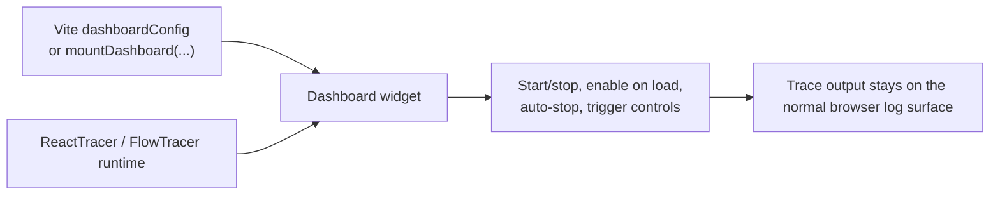

# @autotracer/dashboard

## Overview

`@autotracer/dashboard` is the AutoTracer browser widget package. It mounts an in-app control surface for starting, stopping, and narrowing tracing sessions in browser-based internal web apps.

Keep the dashboard out of publicly accessible builds. The intended use case is local development and restricted internal test or QA environments.

## Why Use It

Use the dashboard when tracing should stay dormant until you open a narrow capture window around one interaction.

The widget is the normal browser control surface for AutoTracer, but it does not replace build-time gating, it does not initialize `reactTracer(...)` for you, and it does not turn the page into a trace viewer.



## Installation

```bash
pnpm add -D @autotracer/dashboard
```

If your app uses the Vite plugin path, install this package alongside the tracer runtime and the relevant Vite plugin package.

## Public Surface

This package exports these runtime surfaces:

- `mountDashboard(config?)`
- `toggleDashboard()`
- `DashboardConfig`
- `DashboardPosition`
- `HotkeyConfig`
- `WidgetControls`

This package does not export a `dashboardConfig` initializer. `dashboardConfig` is the build-time setting owned by `@autotracer/plugin-vite-react18`, `@autotracer/plugin-vite-react19`, and `@autotracer/plugin-vite-flow`, and it reuses the `DashboardConfig` shape.

## Configuration

If your browser app already uses a ReactTracer or FlowTracer Vite plugin, prefer the plugin-owned `dashboardConfig` path.

```typescript
import { defineConfig } from "vite";
import react from "@vitejs/plugin-react";
import { reactTracer } from "@autotracer/plugin-vite-react18";

export default defineConfig(({ mode }) => {
  const isInternalBrowserBuild =
    mode === "development" || process.env.INTERNAL_QA === "true";

  return {
    plugins: [
      reactTracer.vite({
        inject: isInternalBrowserBuild, // Remove the whole plugin from publicly accessible builds.
        dashboardConfig: {
          enabled: true, // Optional. Set false to suppress the widget without changing the inject gate.
          hideByDefault: true, // Start hidden until a developer opens the widget or starts tracing.
          position: "bottom-right", // Pin the widget to one fixed screen corner.
          hotkeys: {
            toggleTracing: "Alt+Shift+T", // Start or stop whichever tracers are available.
            toggleDashboard: "Alt+Shift+D", // Show or hide the widget itself.
          },
        },
      }),
      react(),
    ],
  };
});
```

`inject` already gates the whole Vite plugin. When `inject` is `false`, `dashboardConfig` is ignored and the dashboard does not mount.

Use `mountDashboard(...)` when you do not have that Vite path available, or when you need to mount the widget manually in a browser runtime.

```typescript
const shouldMountDashboard =
  import.meta.env.DEV || import.meta.env.VITE_INTERNAL_QA === "true";

async function bootstrap(): Promise<void> {
  if (shouldMountDashboard) {
    const { mountDashboard } = await import("@autotracer/dashboard");

    mountDashboard({
      hideByDefault: true,
      position: "bottom-left",
    });
  }
}

void bootstrap();
```

In React apps, the widget does not replace the separate `reactTracer(...)` bootstrap before React renders.

Package-side configuration fields behave like this:

- `enabled: false` on the Vite path: the plugin skips all dashboard injection; `@autotracer/dashboard` is not bundled. Equivalent to omitting `dashboardConfig`. On the manual path: `mountDashboard()` returns early without mounting.
- `hideByDefault` only affects the first unseen load. Once tracing is started from the widget or from the shared tracing hotkey, the dashboard marks itself as shown in `localStorage`, and later loads start visible.
- `position` places the widget in one of four fixed screen corners: `bottom-right`, `bottom-left`, `top-right`, or `top-left`.
- `hotkeys.toggleTracing` defaults to `Alt+Shift+T`, and `hotkeys.toggleDashboard` defaults to `Alt+Shift+D`.

## Usage

`mountDashboard(...)` merges configuration in this order:

1. Runtime config passed to `mountDashboard(...)`
2. Vite-plugin injected `globalThis.__autoTracerDashboardConfig`
3. Built-in defaults

The current built-in defaults are:

- `enabled: true`
- `hideByDefault: true`
- `position: "bottom-right"`
- `hotkeys.toggleTracing: "Alt+Shift+T"`
- `hotkeys.toggleDashboard: "Alt+Shift+D"`

Duplicate mounts are ignored. Later `mountDashboard(...)` calls return when widget controls are registered or the dashboard already exists in its DOM root. This keeps one widget mounted in islands and microfrontend browser setups even when another tracer replaces the shared global object.

`toggleDashboard()` restores widget controls when a tracer initializer has replaced `globalThis.autoTracer`, then changes dashboard visibility. Application buttons should use this command instead of reading `globalThis.autoTracer.widget` directly.

The dashboard can mount before ReactTracer or FlowTracer is initialized. After mounting, it keeps polling for tracer availability and updates when those runtimes appear later in the page lifecycle.

The React tab is version-neutral. It controls the single `globalThis.autoTracer.reactTracer` surface provided by either `@autotracer/react18` or `@autotracer/react19`. A page containing both React product lines still has one shared ReactTracer control.

The shared hotkeys behave like this:

- `toggleTracing` starts or stops whichever tracers are available in the page. When it starts any tracer, the widget marks itself as shown and becomes visible.
- `toggleDashboard` changes widget visibility only.
- Hotkeys are ignored while focus is inside an `input`, `textarea`, or `contenteditable` element.

After mounting, widget controls are available on `globalThis.autoTracer.widget`:

```typescript
globalThis.autoTracer.widget.show();
globalThis.autoTracer.widget.hide();
globalThis.autoTracer.widget.toggle();
globalThis.autoTracer.widget.isVisible();
globalThis.autoTracer.widget.unregisterHotkeys();
```

These methods control the widget only. `show()`, `hide()`, and `toggle()` change current visibility but do not persist the shown-before state used by `hideByDefault`. `unregisterHotkeys()` removes only the dashboard keydown listener.

## Troubleshooting

If the dashboard should not ship in a build, gate the `inject` option or the `mountDashboard(...)` call itself. `enabled: false` suppresses the widget at runtime but does not prevent the package from being loaded.

If the widget mounts but React controls are missing, initialize `reactTracer(...)` separately before React renders. The dashboard only controls the runtime surface that already exists in the page.

If multiple browser islands call `mountDashboard(...)`, the first successful mount wins by design and later calls return immediately.

If the host platform does not give you practical console or DevTools access, the dashboard can still control capture, but it does not become a trace-output viewer.

Use these docs for the full browser workflow and exact setting behavior:

- Dashboard package reference: https://docs.autotracer.dev/dashboard/reference
- Dashboard workflow for web apps: https://docs.autotracer.dev/dashboard/webapps
- Platform guidance: https://docs.autotracer.dev/dashboard/platforms
- React Vite `dashboardConfig`: https://docs.autotracer.dev/reference/build/react18/vite/config/dashboardConfig
- React 19 Vite `dashboardConfig`: https://docs.autotracer.dev/reference/build/react19/vite/config/dashboardConfig
- Flow Vite `dashboardConfig`: https://docs.autotracer.dev/reference/build/flow/vite/config/dashboardConfig

## License

MIT © Carl Ribbegårdh
