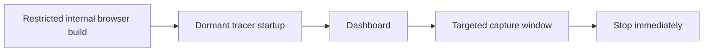

# Dashboard

Use the AutoTracer Dashboard when your app runs in a browser and broad tracing would otherwise produce too much noise.

The dashboard is a browser control surface for AutoTracer. It can start and stop tracers, persist dormant-mode settings, and narrow capture windows with start and end triggers. It does not display trace output, it does not make a console available on platforms that do not already expose one, and it does not initialize ReactTracer for you.

## Recommended Setup Path

If your browser app already uses `@autotracer/plugin-vite-react18` or `@autotracer/plugin-vite-flow`, prefer the plugin-owned `dashboardConfig` path. That keeps dashboard mounting on the same build-time path as tracer injection and dormant browser startup.

Use `mountDashboard(...)` from `@autotracer/dashboard` when you do not have that Vite-plugin path available, or when you need to mount the widget manually in a browser runtime.

The dashboard is only the control surface. React browser apps still need `reactTracer(...)`, and Flow browser apps still need the normal Flow runtime path.

## When The Dashboard Is The Default Choice

- Browser-based web apps where tracing is too noisy when left broadly enabled.
- Internal QA or staging builds where you want targeted runtime control without editing code between sessions.
- Islands, microfrontends, and mixed React plus Flow browser bundles where one widget can control the tracers that are present.

## What The Dashboard Controls

- ReactTracer start and stop.
- FlowTracer start and stop.
- Enable-on-load preferences persisted in local storage.
- Auto-stop limits for React renders and Flow function counts.
- Start triggers, end triggers, end-trigger timing, and trigger re-arm mode.
- Widget visibility and hotkeys.

## Dashboard States

The widget makes tracer state obvious at a glance.

  <figure class="dashboard-screenshot-card">
    
    
    <figcaption>Both tracers idle</figcaption>
  </figure>

  <figure class="dashboard-screenshot-card">
    
    
    <figcaption>React tracer running</figcaption>
  </figure>

  <figure class="dashboard-screenshot-card">
    
    
    <figcaption>Both tracers running</figcaption>
  </figure>

The floating toggle also exposes a clear active state.

  <figure class="dashboard-toggle-card">
    
    
    <figcaption>Toggle active</figcaption>
  </figure>

  <figure class="dashboard-toggle-card">
    
    
    <figcaption>Toggle inactive</figcaption>
  </figure>

## What The Dashboard Does Not Do

- It does not display logs or traces itself.
- It does not make browser console, DevTools, or any other log surface available on platforms that do not already expose one.
- It does not replace build-time gating. If you ship the dashboard in a build, you shipped the dashboard.
- It does not initialize ReactTracer. React browser apps still need a `reactTracer(...)` bootstrap.

## Read Next

- [Dashboard For Web Apps](/dashboard/webapps)
- [Platform Guidance](/dashboard/platforms)
- [Package Reference](/dashboard/reference)
