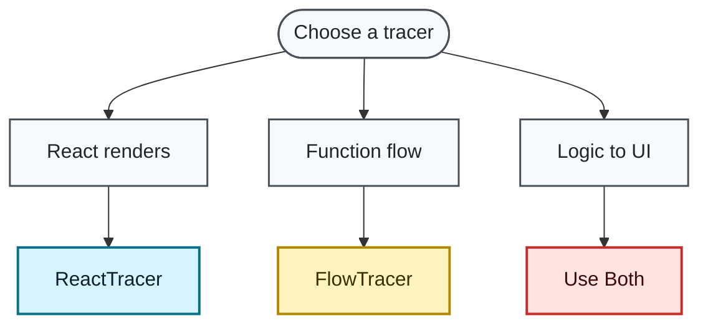

# Choosing Your Tracer

AutoTracer provides two specialized tracers for different use cases. This guide helps you decide which tracer (or both) fits your needs.

## Quick Selector



## FlowTracer

### What It Traces

- **Function calls** - Entry and exit of functions selected by the build transform
- **Parameters** - Values passed to functions
- **Return values** - What functions return
- **Execution timing** - How long functions take
- **Call chains** - How functions call each other

### Best For

✅ **General JavaScript/TypeScript debugging**

- Business logic
- Data processing
- API integrations
- Utility functions
- Async operations

✅ **Non-React code**

- Node.js backends
- Vanilla JavaScript
- Vue, Svelte, or other frameworks

✅ **Performance analysis**

- Identifying slow functions
- Optimization targets
- Bottleneck detection

### Example Output

```
→ calculateDiscount
param order: {"total":100,"customer":{"tier":"gold"}}
  → getCustomerTier
  param customer: {"tier":"gold"}
  returned: "gold"
  ← getCustomerTier (elapsed: 0.1ms)
  → applyGoldDiscount
  param total: 100
  returned: 90
  ← applyGoldDiscount (elapsed: 0.2ms)
returned: 90
← calculateDiscount (elapsed: 1.5ms)
```

### When NOT to Use

FlowTracer alone won't show:

❌ **React component renders** - You need ReactTracer to see when/why components render<br/>
❌ **State/prop values** - ReactTracer extracts these from React internals<br/>

**Note:** For complete visibility (code execution → component render), use BOTH tracers together.

## ReactTracer

### What It Traces

- **Component renders** - Mount and update events
- **State changes** - Before and after values with variable names
- **Prop changes** - Which props changed and how
- **Render cycles** - Logical grouping of related renders
- **Component hierarchy** - Parent-child relationships

### Best For

✅ **React debugging**

- Understanding re-renders
- Tracking state mutations
- Prop change analysis
- Component lifecycle

✅ **Performance optimization**

- Identifying unnecessary re-renders
- Finding render bottlenecks
- Analyzing component updates

✅ **Learning React**

- Understanding React behavior
- Visualizing render flow
- Debugging hooks

### Example Output

```
Component render cycle 1:
├─ [App] Mount ⚡
│   Initial state user: {"name":"Alice"}
│   Initial state count: 0

Component render cycle 2:
├─ [Counter] Mount ⚡
│   Initial prop value: 0
│   Initial state localCount: 0

Component render cycle 3:
├─ [Counter] Rendering ⚡
│   State change localCount: 0 → 1
```

### When NOT to Use

ReactTracer alone won't show:

❌ **Function execution flow** - You need FlowTracer to see what code runs<br/>
❌ **API calls and responses** - FlowTracer traces these<br/>
❌ **Business logic timing** - FlowTracer provides execution timing<br/>

**Note:** For complete visibility (code execution → component render), use BOTH tracers together.

## Using Both Tracers

Many applications benefit from using both tracers together.

### Complementary Usage

Use [Your First Trace](./first-trace) for a complete Vite setup with both tracers. It keeps both dormant until you start a capture, initializes ReactTracer before rendering, and instruments only the selected source.

### Example Scenario

```typescript
// API utility (traced by FlowTracer)
async function fetchUserData(userId) {
  const response = await fetch(`/api/users/${userId}`);
  return response.json();
}

// React component (traced by ReactTracer)
function UserProfile({ userId }) {
  const [user, setUser] = useState(null);

  useEffect(() => {
    fetchUserData(userId).then(setUser);
  }, [userId]);

  return <div>{user?.name}</div>;
}
```

**Illustrative output excerpt** (the function and render observations below are grouped by tracer, not presented as a guaranteed chronological transcript):

```
// FlowTracer output
→ fetchUserData (async started)
param userId: 123
returned: Promise
← fetchUserData (async completed, elapsed: 142.7ms)

// ReactTracer output
Component render cycle 1:
├─ [UserProfile] Mount ⚡
│   Initial prop userId: 123
│   Initial state user: null

Component render cycle 2:
├─ [UserProfile] Rendering ⚡
│   State change user: null → {"id":123,"name":"Alice"}
```

## Comparison Matrix

| Feature       | FlowTracer             | ReactTracer           |
| ------------- | ---------------------- | --------------------- |
| **Target**    | Functions              | React Components      |
| **Scope**     | Any JavaScript         | React only            |
| **Tracking**  | Calls, params, returns | Renders, state, props |
| **Setup**     | Build plugin           | Runtime hook          |
| **Overhead**  | Depends on scope and output volume | Depends on tree traversal and output volume |
| **Use Case**  | Logic debugging        | UI debugging          |
| **Framework** | Agnostic               | React-specific        |

## Installation Complexity

### FlowTracer

- Requires build-time plugin (Babel or Vite)
- Works with any bundler
- One-time setup

### ReactTracer

- Simple runtime import
- Optional build-time plugin for labels
- Requires a DevTools hook installed before React evaluates and initialization before the relevant render

## Decision Examples

### Example 1: Pure React App

**Scenario:** Building a React dashboard with complex state management

**Recommendation:** Start with **ReactTracer only**

- Focus on component interactions
- Track state changes
- Optimize re-renders

Add FlowTracer later if you need to debug data processing logic.

### Example 2: Full-Stack Application

**Scenario:** React frontend + API integration + business logic

**Recommendation:** Use **both tracers**

- ReactTracer for UI components
- FlowTracer for API calls and business logic
- Function and render observations; connections across browser and server runtimes require explicit evidence

### Example 3: Performance Optimization

**Scenario:** Slow application, need to find bottlenecks

**Recommendation:** Start with **ReactTracer**

- Identify unnecessary re-renders (most common cause)
- Check component update frequency

If React performance is fine, add **FlowTracer** to find slow functions.

### Example 4: Vue or Svelte App

**Scenario:** Non-React JavaScript framework

**Recommendation:** **FlowTracer only**

- ReactTracer requires React
- FlowTracer works with any framework

### Example 5: Learning React

**Scenario:** New to React, want to understand how it works

**Recommendation:** **ReactTracer only**

- See exactly when and why components render
- Understand state and prop flow
- Learn React lifecycle

## Next Steps

Based on your decision:

### Chosen FlowTracer?

→ [FlowTracer Quick Start](./quickstart-flow)

### Chosen ReactTracer?

→ [ReactTracer Quick Start](./quickstart-react)

### Chosen Both?

Follow [Your First Trace](./first-trace), or use [the agent skills](./agents) to set up and capture a specific action.
