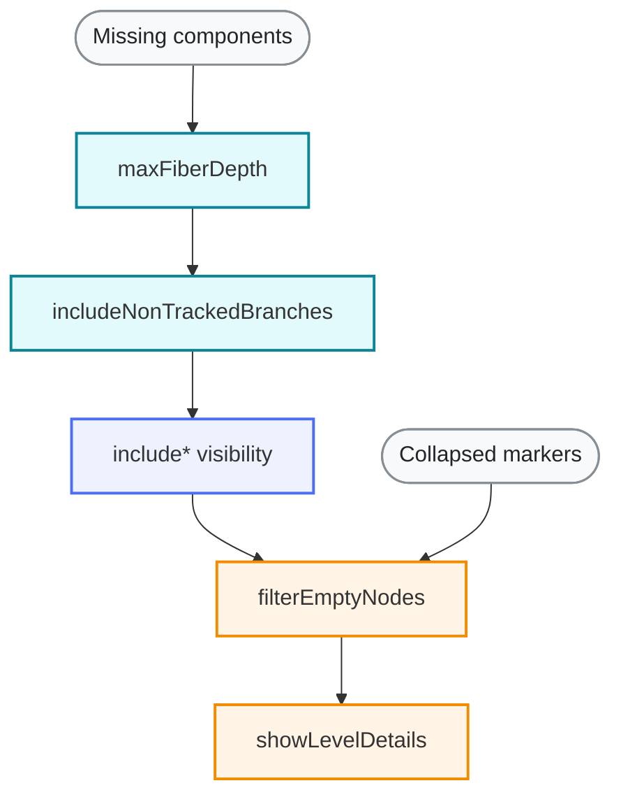
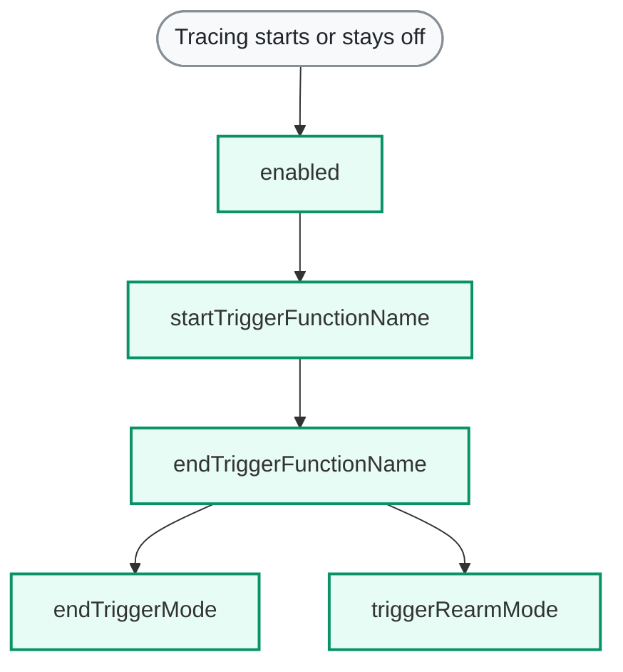
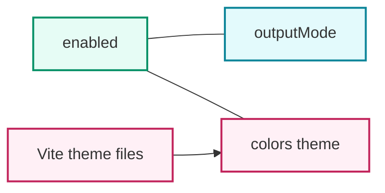

# ReactTracer Runtime Settings

**Package:** `@autotracer/react19` &nbsp;·&nbsp; **Layer:** Runtime &nbsp;·&nbsp; **Type:** Overview

---

Start here before changing individual settings in isolation.

## Tree Visibility

## Trigger Sessions

## Startup And Appearance

`include*` = [`includeMount`](./config/includeMount), [`includeRendered`](./config/includeRendered), [`includeReconciled`](./config/includeReconciled), and [`includeSkipped`](./config/includeSkipped).

## Prop Noise

Use [`skippedObjectProps`](./config/skippedObjectProps) when prop output is dominated by framework objects, styling props, or callback props that are not useful for the debugging question in front of you.

This setting only reduces ReactTracer prop-output noise for exact component-name matches. It is not meant for suppressing user identifiers in production environments.

## Non-Overrides

[`detectIdenticalValueChanges`](./config/detectIdenticalValueChanges) adds warnings only to nodes that are already visible. It does not override the `include*` visibility settings or [`filterEmptyNodes`](./config/filterEmptyNodes).

## Start Here

If components are missing, read [`maxFiberDepth`](./config/maxFiberDepth), [`includeNonTrackedBranches`](./config/includeNonTrackedBranches), the four `include*` visibility settings above, and then [`filterEmptyNodes`](./config/filterEmptyNodes).

If collapsed markers are confusing, read [`filterEmptyNodes`](./config/filterEmptyNodes) together with [`showLevelDetails`](./config/showLevelDetails).

If prop output is noisy, read [`skippedObjectProps`](./config/skippedObjectProps) before treating repeated prop churn as a meaningful signal.

If trigger-driven sessions behave unexpectedly, read [`enabled`](./config/enabled), [`startTriggerFunctionName`](./config/startTriggerFunctionName), [`endTriggerFunctionName`](./config/endTriggerFunctionName), [`endTriggerMode`](./config/endTriggerMode), and [`triggerRearmMode`](./config/triggerRearmMode) together.

If tracing starts correctly but the output format or styling is wrong for your workflow, read [`enabled`](./config/enabled), [`outputMode`](./config/outputMode), and [`colors`](./config/colors) together. If you use `@autotracer/plugin-vite-react19`, injected theme files can still override overlapping project defaults locally.

The remaining lower-priority settings mainly affect diagnostics or specialized workflows: [`showFlags`](./config/showFlags), [`internalLogLevel`](./config/internalLogLevel), and [`trackedStateResolution`](./config/trackedStateResolution).
