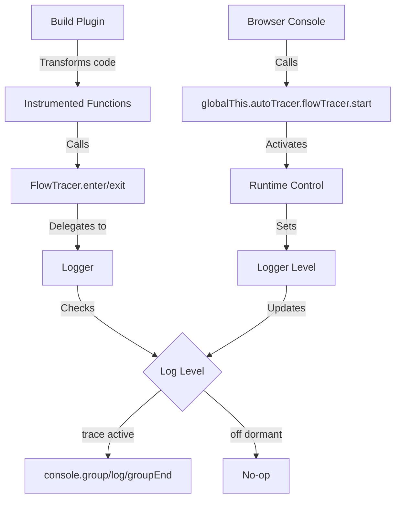

# @autotracer/flow

**Automatic function flow tracing with dormant mode, Dashboard workflow, and lower-level runtime control.**

See exactly what your code is doing—function calls, parameters, return values, exceptions, and nested call stacks—all logged automatically without writing a single `console.log`. In internal browser apps, the normal control surface is the Dashboard workflow. The lower-level `globalThis.autoTracer.flowTracer` API is for tests, automation, and setups that do not mount the Dashboard. In all of those setups, your functions are still instrumented at build time, so tracing can stay dormant until you start it.

## Installation

You need **two packages**: the core library and a build plugin.

**For Vite projects:**

```bash
pnpm add @autotracer/flow @autotracer/logger
pnpm add -D @autotracer/plugin-vite-flow
```

**For Next.js / Babel projects:**

```bash
pnpm add @autotracer/flow @autotracer/logger
pnpm add -D @autotracer/plugin-babel-flow
```

**Note:** `@autotracer/logger` is a required dependency of `@autotracer/flow`. While it's listed as a dependency and should be automatically installed, explicitly including it ensures compatibility across different package managers.

### Monorepo / Workspace Setup

When using `@autotracer/flow` from a local workspace (e.g., in a monorepo), add Vite aliases to resolve the packages:

```ts
// vite.config.ts
import path from "path";

export default defineConfig({
  resolve: {
    alias: {
      "@autotracer/flow/runtime": path.resolve(
        __dirname,
        "path/to/packages/auto-tracer-flow/dist/runtime.js",
      ),
      "@autotracer/flow": path.resolve(
        __dirname,
        "path/to/packages/auto-tracer-flow",
      ),
      "@autotracer/logger": path.resolve(
        __dirname,
        "path/to/packages/auto-tracer-logger",
      ),
    },
  },
  // ... rest of config
});
```

**Important:** The `/runtime` alias must come **before** the base `@autotracer/flow` alias for proper resolution.

## What You Get

- **Automatic function tracing** - Entry, exit, parameters, and return values logged automatically
- **Dormant mode** - Tracing stays available on demand while console output remains off until activated
- **Lower-level runtime API** - Activate/deactivate tracing via `globalThis.autoTracer.flowTracer.start()` / `globalThis.autoTracer.flowTracer.stop()` when you are not using the Dashboard workflow
- **Exception logging** - Errors logged before they're caught or thrown
- **Call stack visualization** - Nested calls shown with console.group nesting
- **Framework-agnostic** - Works with any JavaScript/TypeScript application

For internal browser apps, treat the Dashboard as the normal control surface. Use the lower-level runtime API in tests, automation, and setups that do not mount the Dashboard.

### Perfect for Large Teams and Unfamiliar Code

When working on large customer solutions with many developers, you often need to troubleshoot or understand code you didn't write. Flow tracing gives you the most exact and powerful way to see what's happening:

- **Faster than stepping** - See the complete execution flow instantly instead of stepping through hundreds of function calls
- **Search and filter** - Console output is searchable, making it easy to find specific function calls or parameters
- **Automatic relevance** - Chrome's console.group collapsing means you only see the code paths that actually executed
- **Zero instrumentation** - No manual logging needed, no code changes required
- **Complete context** - Parameters, return values, and timing all captured automatically

**Example scenario:** A bug appears in a multi-step checkout flow. Instead of setting 20 breakpoints and stepping through each function, activate flow tracing, reproduce the issue, and get a complete trace of every function call, parameter, and return value. Search the console for the problematic value and see exactly which function produced it.

### React Integration

Combine `@autotracer/flow` with `@autotracer/react18` for React projects to get complete insight into both execution flow and React lifecycle:

- **State and props tracking** - See exactly when state and props change in each component
- **Render cycle visibility** - Understand what happens on every render cycle
- **Full execution context** - Function calls interleaved with React render events
- **Component hierarchy** - See which components render and in what order

This combination gives you unprecedented visibility into React applications, making it easy to understand performance issues, unnecessary re-renders, and complex state interactions.

## Quickstart

> **Note:** The examples below show Vite configuration. For Next.js/Babel setup, see the [Integration Guides](#integration-guides) section.

### Normal Mode (Local Development)

For immediate tracing output during local development, opt out of the dormant default explicitly with `runtimeControlled: false`:

```ts
// vite.config.ts
import { flowTracer } from "@autotracer/plugin-vite-flow";

export default {
  plugins: [
    flowTracer({
      inject: true,
      runtimeControlled: false, // Tracing always active
      include: {
        paths: ["**/src/**"],
        functions: ["*"],
      },
    }),
  ],
};
```

All instrumented functions immediately produce console output. No browser console commands needed.

### Dormant Mode (TEST/QA Deployments)

For restricted internal test/QA deployments where tracing should be off by default but available on-demand:

```ts
// vite.config.ts
import { flowTracer } from "@autotracer/plugin-vite-flow";

export default {
  plugins: [
    flowTracer({
      inject: true,
      runtimeControlled: true, // Start dormant, activate via console
      include: {
        paths: ["**/src/**"],
        functions: ["*"],
      },
    }),
  ],
};
```

If this setup mounts the Dashboard, start and stop tracing there. If it does not, use the lower-level runtime API:

```js
// Activate flow tracing
globalThis.autoTracer.flowTracer.start();

// Your instrumented functions now produce console output

// Deactivate flow tracing
globalThis.autoTracer.flowTracer.stop();
```

## What You'll See

When tracing is active and you call instrumented functions:

```
handleAdd
  add
    params: 5 3
    returned: 8
    add (elapsed: 0.5ms)
  handleAdd (elapsed: 1.2ms)
```

With exceptions:

```
divide
  params: 10 0
  💥 Exception in divide: Error: Division by zero
    at divide (App.tsx:64:13)
    at safeDivide (App.tsx:87:12)
    ...
  divide (elapsed: 1.4ms)
```

## API Reference

### Global Runtime API

When `@autotracer/flow/runtime` is imported, these are available globally:

```typescript
// Main runtime control surface
globalThis.autoTracer: {
  getOutputMode(): "devtools" | "copy-paste"
  setOutputMode(mode: "devtools" | "copy-paste"): void
  flowTracer: {
    start(): void
    stop(): void
    isEnabled(): boolean
    addFilter(match: string): void
    showFilters(): string
    clearFilters(): void
    filterMode(enabled?: boolean): boolean
  }
}

// Internal (injected-code) tracer surface.
// This is intentionally not part of the human-facing console API.
globalThis.__flowTracer: {
  enter(functionName: string): unknown
  exit(handle: unknown): void
  traceParameter(name: string, value: unknown): void
  // ... additional internal trace helpers
}
```

### Runtime Filtering

Flow tracing supports runtime name-only filtering that is persisted in `localStorage`.

```js
// Add a runtime filter (name-only, supports glob-style patterns)
globalThis.autoTracer.flowTracer.addFilter("noise*");

// Print and return a copy/paste snippet for compile-time config
globalThis.autoTracer.flowTracer.showFilters();
// -> exclude: { functions: ["noise*"] }

// Clear only runtime filters
globalThis.autoTracer.flowTracer.clearFilters();
```

#### Copy/Paste Assist (`filterMode`)

Enable “filterMode” to append a copy/paste-ready snippet to each traced function row.

```js
// Enable per-row copy/paste snippets (not persisted)
globalThis.autoTracer.flowTracer.filterMode();

// Disable per-row copy/paste snippets
globalThis.autoTracer.flowTracer.filterMode(false);
```

Notes:

- Filters persist across reloads; `filterMode` does not.
- Matching is by function name only (paths are not available at runtime).

### Startup Output Mode

To avoid needing runtime console calls, configure output formatting at startup.

**Vite:** set `outputMode` on `@autotracer/plugin-vite-flow`. This is injected into the page before any runtime imports, so grouping is correct from the first trace.

**Next.js / Babel:** set `outputMode` on `@autotracer/plugin-babel-flow`. The plugin injects startup configuration into modules that import `@autotracer/flow/runtime`.

### Grouping Mode Control

Grouping mode is controlled via `outputMode`:

- **`"devtools"`** - Uses native `console.group()` for interactive collapsible groups
- **`"copy-paste"`** - Uses UTF-8 box-drawing characters for copy-paste friendly output

```js
// Copy/paste-friendly output
globalThis.autoTracer.setOutputMode("copy-paste");

// DevTools-friendly output
globalThis.autoTracer.setOutputMode("devtools");
```

**Use cases:**

- **DevTools mode**: Best for interactive debugging in browser DevTools
- **Copy-paste mode**: Best when you need to copy console output to share with teammates or file bug reports

In **`"copy-paste"`** mode, `@autotracer/flow` also formats complex values (objects, arrays, errors, maps, sets) as stable JSON text so the console output is reliably copyable.

**Convenience API:**

Use `globalThis.autoTracer.setOutputMode(...)` to switch between interactive DevTools grouping and copy/paste-friendly output.

### Themed Output

All flow tracing output uses themed styling with semantic categories:

- **Function Entry** (`→`) - Synchronous function entry with themed arrow
- **Function Exit** (`←`) - Synchronous function exit with duration
- **Async Start** (`🚀`) - Async function entry
- **Async Complete** (`✅`) - Async function completion
- **Parameters** - Function parameters in italic style
- **Return Values** - Return values in plain style
- **Exceptions** (`💥`) - Caught exceptions with stack traces
- **Runtime Control** (`🔧`) - Runtime control messages (start/stop tracing)

Each category can be customized with `lightMode` and `darkMode` values via theme configuration files (see Theme File Configuration below).

## Theme File Configuration

Use theme files in a Vite project when you want file-based visual overrides without changing startup code. The files are loaded by `@autotracer/plugin-vite-flow` and apply to the global tracer installed by `@autotracer/flow`.

For normal app integrations, use theme files. If you create your own tracer with `createFlowTracer(logger, config)`, use the manual `theme` object instead.

Supported file patterns:

- `*flow-theme.json`
- `*flow-theme-light.json`
- `*flow-theme-dark.json`

Theme files use `lightMode` and `darkMode` keys.

If the files are personal overrides, keep them out of git. This is the easiest way to support local accessibility or personal visual preferences without changing shared startup code.

For the exact category shape, load order, and copyable examples, use these pages:

- [FlowTracer Theme Files](./THEME-FILES.md)
- [FlowTracer Theme API](https://docs.autotracer.dev/themes/flow/api)
- [FlowTracer Theme Examples](https://docs.autotracer.dev/themes/flow/examples)

## Integration Guides

### Vite

```ts
// vite.config.ts
import { flowTracer } from "@autotracer/plugin-vite-flow";

export default {
  plugins: [
    flowTracer({
      inject: true,
      runtimeControlled: true,
      include: {
        paths: ["**/src/**"],
        functions: ["handle*", "calculate*"],
      },
      exclude: {
        functions: ["handleError"], // Skip specific functions
      },
    }),
  ],
};
```

The plugin will automatically inject `import "@autotracer/flow/runtime"` into your HTML when `runtimeControlled: true`.

### Next.js / Babel

```js
// babel.config.js
module.exports = {
  plugins: [
    [
      "@autotracer/plugin-babel-flow",
      {
        include: {
          paths: ["**/src/**"],
        },
      },
    ],
  ],
};
```

Then lazy-load the runtime behind a compile-time-removable client flag and render your traced tree only after it resolves:

```tsx
// app/AutoTracerFlowBootstrap.tsx or components/AutoTracerFlowBootstrap.tsx
"use client"; // App Router only

import { Suspense, lazy, type ReactNode } from "react";

const isDevelopment = process.env.NODE_ENV === "development";
const isInternalQa = process.env.NEXT_PUBLIC_INTERNAL_QA === "true";

const AutoTracerFlowBoundary = lazy(async () => {
  if (isDevelopment || isInternalQa) {
    await import("@autotracer/flow");
    await import("@autotracer/flow/runtime");
  }

  return {
    default: ({ children }: { children: ReactNode }) => <>{children}</>,
  };
});

export function AutoTracerFlowBootstrap({ children }: { children: ReactNode }) {
  return (
    <Suspense fallback={null}>
      <AutoTracerFlowBoundary>{children}</AutoTracerFlowBoundary>
    </Suspense>
  );
}
```

Render that boundary first from `app/layout.tsx` or `pages/_app.tsx`. The Babel plugin transforms your functions at build time. The lazy imports provide the dormant runtime surface without shipping it in publicly accessible builds. In browser apps that mount the Dashboard, use that as the normal control surface. Otherwise the lower-level `globalThis.autoTracer.flowTracer` API remains available.

## Filtering: Include and Exclude Patterns

Control which functions get instrumented using `include` and `exclude` patterns:

### Function Patterns

Match functions by name using glob patterns, regular expressions, or exact strings:

```ts
flowTracer({
  include: {
    functions: ["handle*", "on*", "process*"], // Only event handlers and processors
  },
  exclude: {
    functions: ["handleError", "onInit"], // Skip specific functions
  },
});
```

**Pattern matching:**

- Glob patterns: `"handle*"`, `"*Click"`, `"on*Event"`
- Regular expressions: `/^handle[A-Z]/`, `/^on[A-Z]\w+$/`
- Exact strings: `"handleSubmit"`, `"onClick"`

### File Path Patterns

Instrument only files in specific directories:

```ts
flowTracer({
  include: {
    paths: ["**/src/**"], // Only instrument source files
  },
  exclude: {
    paths: ["**/src/utils/**", "**/src/config/**"], // Skip utilities and config
  },
});
```

**Path patterns use glob syntax:**

- `**/src/**` - All files under any `src` directory
- `**/components/**/*.tsx` - All TSX files in any `components` directory
- `src/features/**` - Files under `src/features` (non-recursive without `**`)

### Combined Filtering

Both function and path patterns can be used together. A function is instrumented only if it matches **all** include criteria and **none** of the exclude criteria:

```ts
flowTracer({
  include: {
    paths: ["**/src/features/**"],
    functions: ["handle*", "process*"],
  },
  exclude: {
    functions: ["handleError", "processLogs"],
  },
});
```

This configuration:

- ✅ Instruments `handleSubmit` in `src/features/form/FormHandler.ts`
- ❌ Skips `handleError` (excluded function)
- ❌ Skips `fetchData` (not in include functions)
- ❌ Skips any function in `src/utils/` (not in include paths)

## Performance Considerations

### Dormant Mode

When dormant mode is active:

- Instrumented hooks still run inside traced functions
- Console output stays off until `globalThis.autoTracer.flowTracer.start()` is called
- Best fit for restricted internal test and QA deployments

### Active Mode

When tracing is enabled:

- Console logging and DevTools rendering become the main runtime cost
- Verbose output is best used for short, focused tracing sessions
- Not recommended for publicly accessible traffic

### Recommendation

Use dormant mode (`runtimeControlled: true`) in TEST and QA environments. In browser apps that mount the Dashboard, use that as the normal control surface. Use `globalThis.autoTracer.flowTracer.start()` directly in tests, automation, and other non-Dashboard setups.

## Security Considerations

### Do Not Use in Publicly Accessible Deployments

Flow tracing should **never be enabled in publicly accessible deployments** for the following reasons:

1. **Information Disclosure** - Function parameters, return values, and exception details are logged to the browser console, potentially exposing:
   - Authentication tokens and credentials
   - Personal identifiable information (PII)
   - Business logic and internal implementation details
   - API keys and sensitive configuration

2. **Performance Impact** - Active tracing generates significant console I/O overhead that degrades user experience

3. **Attack Surface** - The `globalThis.autoTracer.flowTracer.start()` API is accessible to anyone with browser console access, including malicious actors

### Recommended Setup

- **Local Development** - Use normal mode (`runtimeControlled: false`) for immediate feedback
- **Restricted TEST/QA Environments** - Use dormant mode (`runtimeControlled: true`) for on-demand debugging
- **Publicly Accessible Deployments** - **Disable flow tracing completely** using environment-based configuration:

```ts
// vite.config.ts
import { flowTracer } from "@autotracer/plugin-vite-flow";

const isDev = process.env.NODE_ENV === "development";
const isQA = process.env.DEPLOY_ENV === "qa";

export default {
  plugins: [
    flowTracer({
      inject: isDev || isQA, // Disabled in publicly accessible builds
      runtimeControlled: isQA, // Dormant in QA, active in dev
      include: { paths: ["**/src/**"] },
    }),
  ],
};
```

## Troubleshooting

### No logs appearing

1. If this setup uses the Dashboard, confirm tracing is started there.
2. Otherwise check if runtime control is enabled: `globalThis.autoTracer.flowTracer.isEnabled()`
3. Otherwise activate tracing: `globalThis.autoTracer.flowTracer.start()`
4. Verify functions are instrumented (check build plugin configuration)

### "Flow tracing runtime control ready" message not appearing

The runtime import isn't being loaded. Check:

- Vite plugin has `runtimeControlled: true`
- HTML injection is working (dev mode)
- Or manually import `@autotracer/flow/runtime` in your entry point

### Functions not traced

Check the build plugin's `include`/`exclude` configuration. The plugin only instruments functions matching your patterns.

### Too verbose

Adjust which functions are instrumented:

```ts
flowTracer({
  include: {
    // Only instrument event handlers
    functions: ["handle*", "on*"],
  },
});
```

Or use different log levels:

Adjust which functions are instrumented instead:

```ts
flowTracer({
  include: {
    // Only instrument specific patterns
    functions: ["handle*", "process*"],
  },
});
```

### Performance impact

If you see performance degradation:

- **In development:** Normal - console I/O is slow
- **In restricted internal deployments:** Should be in dormant mode with minimal overhead
- Consider instrumenting fewer functions via `include.functions` patterns

## Internals Overview



## License

MIT © Carl Ribbegårdh
