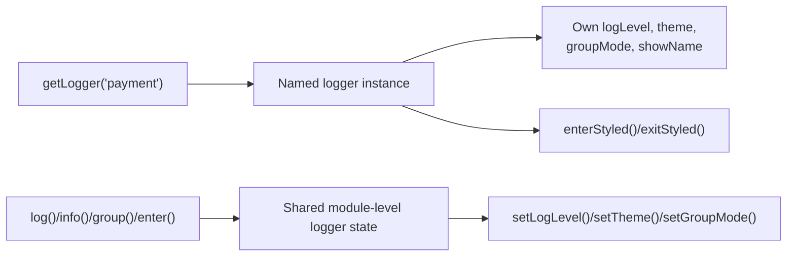

# @autotracer/logger

## Overview

`@autotracer/logger` is the internal shared logger utility used by AutoTracer runtimes, build tooling, and the manual `createFlowTracer(logger, config?)` path in `@autotracer/flow`.

If you use the package directly, prefer `getLogger(name)`. The standalone logging functions operate on one shared module-level logger state instead.

## Why Use It

Use this package directly when you need low-level structured logging, per-logger state, or timing and grouping helpers outside the higher-level AutoTracer runtimes.

In most AutoTracer app integrations, you do not configure this package directly. `@autotracer/flow` and `@autotracer/react18` already use it internally.



## Installation

```bash
pnpm add @autotracer/logger
```

`@autotracer/logger` is already installed transitively by `@autotracer/flow`. Install it directly only when you use the logger package outside that path.

## Public Surface

This package exports these public surfaces:

- `getLogger(name)`
- Named logger configuration methods: `setLogLevel(...)`, `setTheme(...)`, `setGroupMode(...)`, and `setShowName(...)`
- Named logger output methods: `fatal(...)`, `error(...)`, `warn(...)`, `log(...)`, `info(...)`, `debug(...)`, `verbose(...)`, and `trace(...)`
- Named logger grouping and timing helpers: `group(...)`, `groupEnd()`, `enter(...)`, `exit(...)`, `enterStyled(...)`, and `exitStyled(...)`
- Standalone global functions for shared-state output, grouping, timing, and state access: `fatal(...)`, `error(...)`, `warn(...)`, `log(...)`, `info(...)`, `debug(...)`, `verbose(...)`, `trace(...)`, `group(...)`, `groupEnd()`, `enter(...)`, `exit(...)`, `setLogLevel(...)`, `getLogLevel()`, `setTheme(...)`, `getTheme()`, `setGroupMode(...)`, and `getGroupMode()`
- Theme presets: `themes.default`, `themes.minimal`, `themes.emoji`, and `themes.monochrome`
- Types: `Logger`, `LogLevel`, `GroupMode`, `Theme`, `ExitHandle`, and `StyledExitHandle`

This package does not expose build-time settings, runtime initializer settings, `globalThis.autoTracer` APIs, or theme-file discovery surfaces.

## Configuration

Use the named logger path when you need one logger with its own state. `getLogger(name)` returns one cached instance per exact, case-sensitive name.

The named logger path and the standalone global path keep separate configuration state. Changing one does not update the other.

The current defaults are:

- Named loggers: `logLevel: "log"`, `theme: themes.default`, `groupMode: "default"`, `showName: true`
- Standalone global path: `logLevel: "log"`, `theme: themes.default`, `groupMode: "default"`

The exported configuration surface works like this:

- `logLevel` controls verbosity on both paths.
- `groupMode: "default"` uses `console.group()` and `console.groupEnd()`.
- `groupMode: "text"` emits UTF-8 text grouping with indentation.
- `showName` exists only on named logger instances.
- `setTheme(...)` replaces the current theme instead of merging into it.

The built-in theme presets are:

- `themes.default` for the empty default theme
- `themes.minimal` for text prefixes without colors
- `themes.emoji` for emoji prefixes plus colors
- `themes.monochrome` for ASCII-style prefixes without colors

For the exact setting behavior, use these docs:

- Logger package reference: https://docs.autotracer.dev/api/logger
- Logger configuration surfaces: https://docs.autotracer.dev/reference/runtime/logger

## Usage

Prefer `getLogger(name)` when using the package directly.

```typescript
import { getLogger, themes } from "@autotracer/logger";

const logger = getLogger("payment");

logger.setLogLevel("debug");
logger.setTheme(themes.minimal);
logger.setGroupMode("text");

const handle = logger.enter("chargeCard");
logger.info("Authorizing payment", { amount: 42 });
logger.exit(handle);
```

Calling `getLogger("payment")` again returns the same cached instance, so later call sites reuse that logger's configuration and open timing or group state.

Use the standalone global functions when you do not want a named logger instance.

```typescript
import {
  group,
  groupEnd,
  info,
  setGroupMode,
  setLogLevel,
  setTheme,
  themes,
  warn,
} from "@autotracer/logger";

setLogLevel("info");
setTheme(themes.monochrome);
setGroupMode("text");

group("Startup");
info("Booting application");
warn("Low disk space");
groupEnd();
```

This path does not expose `setShowName(...)`, `enterStyled(...)`, or `exitStyled(...)` because there is no named logger instance.

Use `enterStyled(...)` and `exitStyled(...)` only when you need already-styled labels while still keeping the raw label for timing and slow-call warnings.

```typescript
import { getLogger } from "@autotracer/logger";

const logger = getLogger("tracer");
logger.setLogLevel("trace");

const handle = logger.enterStyled(
  "syncUsers",
  "%c→ syncUsers",
  "color: #2563eb",
);

logger.exitStyled(handle, "%c← syncUsers", "color: #16a34a");
```

## Troubleshooting

If your app already uses `@autotracer/flow` or `@autotracer/react18`, you usually do not need to install or configure `@autotracer/logger` directly.

If output on one call site does not match another, check whether one path uses `getLogger(name)` and the other uses the standalone global functions. Those two paths do not share configuration state.

If you are looking for a `logger` singleton object, `formatValue(...)`, `serializeObject(...)`, `indent(...)`, or `treeChars`, those are not exported public surfaces.

The package also does not expose environment-variable configuration for log level or theme.

For the higher-level tracer packages that use this logger internally, see:

- Flow manual tracer path: https://docs.autotracer.dev/api/flow
- React tracer runtime: https://docs.autotracer.dev/api/react18
- Flow Vite plugin: https://docs.autotracer.dev/api/plugin-vite-flow
- React Vite plugin: https://docs.autotracer.dev/api/plugin-vite-react18

## License

MIT © Carl Ribbegårdh
