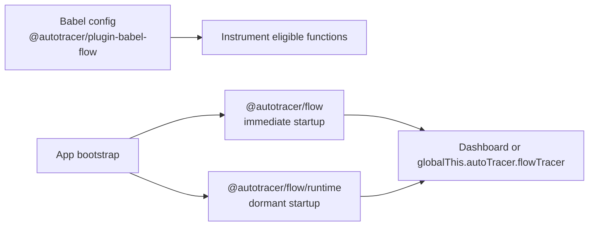

# @autotracer/plugin-babel-flow

## Overview

`@autotracer/plugin-babel-flow` is the AutoTracer build-time plugin for Babel-based apps such as Next.js, Create React App, and custom Babel pipelines. It instruments eligible functions during compilation so Flow tracing can record entry, exit, return values, and exceptions without hand-editing your application code.

For Vite-based apps, use `@autotracer/plugin-vite-flow` instead: https://docs.autotracer.dev/api/plugin-vite-flow

## Why Use It

This package owns build-time instrumentation only. Your app bootstrap still decides whether tracing starts immediately with `@autotracer/flow`, starts dormant with `@autotracer/flow/runtime`, and whether the Dashboard is mounted as the normal browser control surface in restricted internal browser builds.

Keep this plugin out of publicly accessible builds. AutoTracer is intended for local development and restricted internal test or QA environments.



## Installation

```bash
pnpm add @autotracer/flow
pnpm add -D @autotracer/plugin-babel-flow @babel/core
```

If this internal browser app uses the Dashboard as its normal control surface, install it separately:

```bash
pnpm add @autotracer/dashboard
```

`@autotracer/logger` is installed automatically with `@autotracer/flow`. `@babel/core` is the peer dependency required by the Babel plugin.

## Configuration

Add the plugin to your Babel configuration:

```js
module.exports = {
  plugins: [
    [
      "@autotracer/plugin-babel-flow",
      {
        outputMode: "copy-paste",
        mode: "opt-out",
        include: {
          paths: ["**/src/**", "**/app/**"],
          functions: ["handle*", "on*", "fetch*"],
        },
      },
    ],
  ],
};
```

To keep tracing out of publicly accessible production builds on the Babel path, exclude the plugin from the production Babel config itself:

```js
const shouldTrace =
  process.env.NODE_ENV === "development" ||
  process.env.INTERNAL_QA === "true";

module.exports = {
  plugins: [
    ...(shouldTrace
      ? [
          [
            "@autotracer/plugin-babel-flow",
            {
              include: {
                paths: ["src/**"],
              },
            },
          ],
        ]
      : []),
  ],
};
```

On the Babel path, runtime gating alone is not enough. If the plugin stays enabled in a production build, Babel still emits instrumented code even if you never start the Flow runtime.

Use the Babel plugin to choose what gets instrumented with `include`, `exclude`, `mode`, and the `// @trace` and `// @trace-disable` pragmas.

`outputMode` seeds Flow output formatting when a processed bootstrap module imports `@autotracer/flow` or `@autotracer/flow/runtime`, so you do not need a separate `globalThis.autoTracer.setOutputMode(...)` call for that startup path.

Partial `include` and `exclude` objects merge by key. Arrays replace the default value for that key; they are not concatenated.

`tracerName` changes only the local injected binding name inside transformed modules. It does not rename the runtime control surface on `globalThis.autoTracer`.

Use these docs for exact option behavior:

- Flow integration path: https://docs.autotracer.dev/guide/config-flow
- Babel plugin settings: https://docs.autotracer.dev/reference/build/flow/babel/
- Babel pragma comments: https://docs.autotracer.dev/reference/build/flow/babel/pragmas
- Flow runtime settings: https://docs.autotracer.dev/reference/runtime/flow/
- Flow runtime API: https://docs.autotracer.dev/api/flow
- Dashboard workflow: https://docs.autotracer.dev/dashboard/webapps

## Usage

Add the Babel plugin, then lazy-load one Flow runtime entry before the rest of the app runs:

```ts
const shouldLoadFlow = process.env.NODE_ENV === "development";

async function bootstrap(): Promise<void> {
  if (shouldLoadFlow) {
    await import("@autotracer/flow/runtime");
  }

  await import("./app");
}

void bootstrap();
```

Replace `@autotracer/flow/runtime` with `@autotracer/flow` when tracing should start immediately instead of staying dormant at startup.

Use the same environment decision for both the Babel plugin and the runtime import so internal builds get tracing and publicly accessible builds get neither instrumentation nor runtime startup.

In browser-based internal web apps, the Dashboard is the normal control surface when that workflow is mounted. In tests, automation, and other non-Dashboard setups, use `globalThis.autoTracer.flowTracer`.

Keep runtime imports behind development or internal-QA guards so publicly accessible builds can exclude AutoTracer completely.

Use the guide that matches your entry path when you need full setup examples:

- Next.js and other Babel builds: https://docs.autotracer.dev/guide/installation-flow-nextjs
- Flow quick start: https://docs.autotracer.dev/guide/quickstart-flow
- Flow package page: https://docs.autotracer.dev/api/plugin-babel-flow

Pragma comments give you per-function control inside eligible files:

```ts
// @trace
export function checkoutHandler(cartId: string) {
  return `checkout:${cartId}`;
}

// @trace-disable
export function formatLabel(label: string) {
  return label.trim();
}
```

## Advanced Tooling Surface

`@autotracer/plugin-babel-flow` also exposes the shared helpers used by higher-level Flow tooling:

```ts
import {
  DEFAULT_CONFIG,
  normalizeConfig,
  shouldProcessFile,
  type NormalizedBabelPluginFlowConfig,
} from "@autotracer/plugin-babel-flow";
```

Use these exports when you are building wrappers or tooling around the Babel plugin. Normal app integrations should usually stay on the Babel config path shown above.

## Troubleshooting

If functions are not instrumented, confirm that the active Babel config includes `@autotracer/plugin-babel-flow` for the current environment and that the file and function names match your `include` and `exclude` rules.

If there is no console output, check which runtime entry your bootstrap loads. `@autotracer/flow` starts tracing immediately. `@autotracer/flow/runtime` installs the same runtime surface but leaves tracing dormant until you start it from the Dashboard or `globalThis.autoTracer.flowTracer.start()`.

If `__flowTracer is not defined` appears at runtime, the Flow runtime loaded too late. Import `@autotracer/flow` or `@autotracer/flow/runtime` before instrumented application modules execute.

## License

MIT © Carl Ribbegårdh
