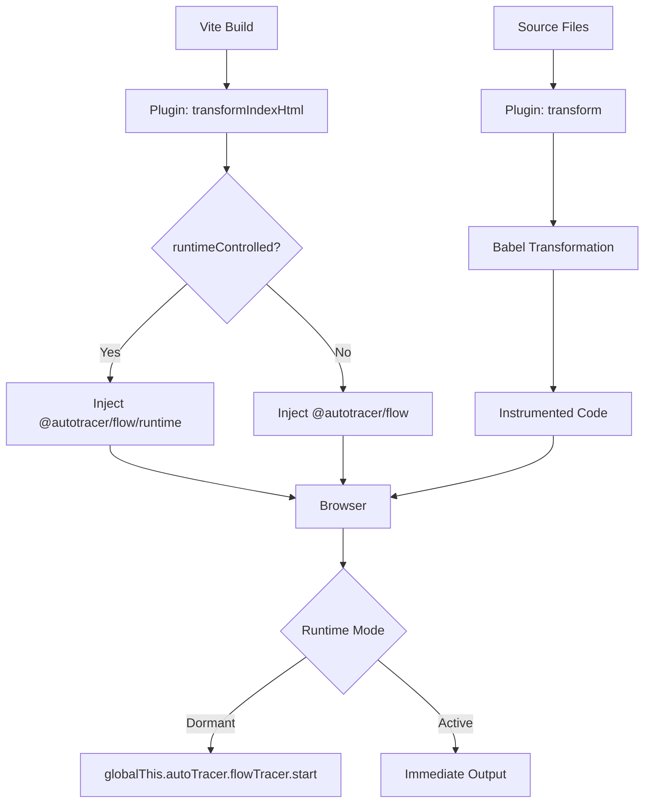

# @autotracer/plugin-vite-flow

**Vite plugin for automatic function flow tracing with dormant mode and runtime control.**

Automatically instruments your functions to track entry, exit, parameters, return values, and exceptions. Optimized for Vite's build pipeline with automatic HTML injection for seamless integration.

## What You Get

- **Zero-config function instrumentation** - Automatically wraps functions with tracing code
- **Automatic runtime injection** - No manual runtime imports needed in Vite apps
- **Selective targeting** - Choose which functions to instrument via patterns
- **Try/catch/finally injection** - Safe exception tracking without breaking error handling
- **Dormant mode** - Zero console overhead until activated later through the Dashboard or lower-level runtime controls
- **Build-time transformation** - Leverages Vite's fast build pipeline

## Who This Is For

If you're using **Vite** (vanilla, React, Vue, Svelte, etc.), this is your plugin.

For **Next.js, Create React App, or other Babel-based builds**, use [@autotracer/plugin-babel-flow](../auto-tracer-plugin-babel-flow/README.md) instead.

## Installation

```bash
pnpm add @autotracer/flow
pnpm add -D @autotracer/plugin-vite-flow @babel/core @babel/preset-typescript
```

**Note:** `@autotracer/logger` installs automatically with `@autotracer/flow`. The Babel packages (`@babel/core` and `@babel/preset-typescript`) are peer dependencies required for code transformation.

**For pnpm users:** Add `auto-install-peers=true` to your `.npmrc` file to automatically install peer dependencies:

```ini
# .npmrc
auto-install-peers=true
```

### Monorepo / Workspace Setup

When using the plugin from a local workspace (e.g., in a monorepo), add Vite aliases:

```ts
// vite.config.ts
import path from "path";

export default defineConfig({
  resolve: {
    alias: {
      "@autotracer/flow/runtime": path.resolve(
        __dirname,
        "../../packages/auto-tracer-flow/dist/runtime.js",
      ),
      "@autotracer/flow": path.resolve(
        __dirname,
        "../../packages/auto-tracer-flow",
      ),
      "@autotracer/logger": path.resolve(
        __dirname,
        "../../packages/auto-tracer-logger",
      ),
    },
  },
  plugins: [
    flowTracer({
      /* ... */
    }),
  ],
});
```

**Important:** The `/runtime` alias must come **before** the base `@autotracer/flow` alias.

## Quickstart

### Dormant Mode (Recommended for TEST/QA)

Start with tracing disabled, then activate it on demand:

`runtimeControlled` defaults to `true`, so the explicit setting below is mainly documentation of intent.

```ts
// vite.config.ts
import { defineConfig } from "vite";
import { flowTracer } from "@autotracer/plugin-vite-flow";

export default defineConfig({
  plugins: [
    flowTracer({
      inject: true,
      runtimeControlled: true, // Start dormant
      dashboardConfig: {},
      include: {
        paths: ["**/src/**"],
        functions: ["handle*", "on*", "process*"],
      },
    }),
  ],
});
```

**No manual imports needed in a Vite app.** When `inject` is `true`, the plugin injects the runtime for you. In browser apps, use the Dashboard as the normal control surface. When the Dashboard is not mounted, the lower-level runtime controls from `@autotracer/flow` remain available.

### Always Active Mode (Local Development)

Immediate console output for all instrumented functions:

```ts
// vite.config.ts
import { defineConfig } from "vite";
import { flowTracer } from "@autotracer/plugin-vite-flow";

export default defineConfig({
  plugins: [
    flowTracer({
      inject: true,
      runtimeControlled: false, // Always active
      include: {
        paths: ["**/src/**"],
        functions: ["*"], // All functions
      },
    }),
  ],
});
```

Functions produce console output immediately - no browser console commands needed.

### Public Deployment Safety

Keep flow tracing out of publicly accessible builds:

```ts
// vite.config.ts
import { defineConfig } from "vite";
import { flowTracer } from "@autotracer/plugin-vite-flow";

const isDev = process.env.NODE_ENV === "development";
const isQA = process.env.DEPLOY_ENV === "qa";

export default defineConfig({
  plugins: [
    flowTracer({
      inject: isDev || isQA, // Disabled in publicly accessible builds
      runtimeControlled: isQA, // Dormant in QA, active in dev
      include: {
        paths: ["**/src/**"],
      },
    }),
  ],
});
```

## Configuration Options

```typescript
interface FlowTracerViteOptions {
  /** Enable/disable code injection (default: true) */
  inject?: boolean;

  /** Start dormant by loading @autotracer/flow/runtime (default: true) */
  runtimeControlled?: boolean;

  /** Set output formatting at startup (default: unset) */
  outputMode?: "devtools" | "copy-paste";

  /** Instrument eligible functions by default or only when @trace is present (default: "opt-out") */
  mode?: "opt-in" | "opt-out";

  /**
   * Prefix prepended to every logged function name (default: undefined).
   *
   * Useful in islands or micro-frontend architectures where multiple independent
   * bundles share the same DevTools console. A prefix makes it immediately clear
   * which app a log entry belongs to.
   *
   * Example: `prefix: "Island1"` → logs `"Island1:processData"` instead of `"processData"`.
   *
   * **Filtering is not affected** — `include`/`exclude` patterns always match
   * against the original, un-prefixed function name. You do not need to update
   * your filter patterns when adding a prefix.
   */
  prefix?: string;

  /** Dashboard widget configuration for runtime controls (default: undefined) */
  dashboardConfig?: Partial<DashboardConfig>;

  /** Name of the injected local tracer identifier (default: "__flowTracer") */
  tracerName?: string;

  /** Log exceptions in catch blocks (default: true) */
  logExceptions?: boolean;

  /** Log level for exceptions (default: "debug") */
  exceptionLogLevel?: "debug" | "warn" | "error";

  /** Files and functions to include */
  include?: {
    /** Glob patterns for file paths */
    paths?: string[];

    /** Function name patterns (glob or regex) */
    functions?: Array<string | RegExp>;
  };

  /** Files and functions to exclude */
  exclude?: {
    /** Glob patterns for file paths */
    paths?: string[];

    /** Function name patterns (glob or regex) */
    functions?: Array<string | RegExp>;
  };
}
```

### Dashboard Widget Configuration

The `dashboardConfig` option enables an in-app widget with hotkey controls for runtime tracer management:

**Requires explicit installation:**

```bash
pnpm add -D @autotracer/dashboard
```

```ts
interface DashboardConfig {
  enabled?: boolean; // Enable/disable dashboard (default: true)
  hideByDefault?: boolean; // Widget hidden on first load (default: true)
  position?: "bottom-right" | "bottom-left" | "top-right" | "top-left"; // Widget position (default: 'bottom-right')
  hotkeys?: {
    toggleTracing?: string; // Hotkey to start/stop all tracers (default: 'Alt+Shift+T')
    toggleDashboard?: string; // Hotkey to show/hide widget (default: 'Alt+Shift+D')
  };
}
```

**Note:** The dashboard is **not** a dependency of this plugin. You must install it explicitly if you want UI controls.

To mount the dashboard with its default settings, pass an empty object: `dashboardConfig: {}`.

During `vite serve`, the plugin versions the dashboard module import for the lifetime of the development-server process. Restarting Vite therefore loads the latest built dashboard package instead of reusing a transformed module from an earlier server. Production builds retain the stable `@autotracer/dashboard` import, and multiple AutoTracer plugins still mount one shared widget.

**Example:**

```ts
flowTracer({
  inject: true,
  runtimeControlled: true,
  dashboardConfig: {
    hideByDefault: true,
    position: "bottom-right",
    hotkeys: {
      toggleTracing: "Alt+Shift+T", // Start/stop Flow tracing
      toggleDashboard: "Alt+Shift+D", // Show/hide widget
    },
  },
});
```

**Smart Visibility:**

- If `hideByDefault: true`, widget is hidden on first load but **persists visibility state** to localStorage
- Once a tracer starts (via hotkey or programmatically), widget auto-shows and remembers this state
- Perfect for QA environments where you want the widget available but not intrusive by default

**Dual Tracer Support:**

- When both `@autotracer/plugin-vite-react18` and `@autotracer/plugin-vite-flow` are active, the dashboard controls **both** tracers
- `Alt+Shift+T` toggles React tracing **and** Flow tracing together

See [@autotracer/dashboard](../auto-tracer-dashboard/README.md) for full documentation and API reference.

### Default Configuration

```ts
{
  inject: true,
  runtimeControlled: true,
  tracerName: "__flowTracer",
  logExceptions: true,
  exceptionLogLevel: "debug",
  mode: "opt-out",
  include: {
    paths: ["**/*.{js,jsx,mjs,ts,tsx,mts}"],
    functions: [],
  },
  exclude: {
    paths: [
      "**/*.test.*",
      "**/*.spec.*",
      "**/node_modules/**",
      "**/dist/**",
      "**/build/**",
      "**/.next/**",
      "**/coverage/**",
      "**/tests/**",
      "**/test/**",
      "**/__tests__/**",
    ],
    functions: [],
  },
}
```

**Partial `include`/`exclude` objects use object-key merge.** Each key you supply replaces the default value for that key only; keys you omit keep their defaults. Supplying only `functions` keeps the default `paths` in place. Supplying only `paths` keeps the default `functions` in place. Arrays are never concatenated — your array replaces the default array for that key.

Config normalization is handled by `@autotracer/plugin-babel-flow`'s `normalizeConfig` — called at plugin init before Babel runs.

## Filtering: Include and Exclude Patterns

Control which functions get instrumented using `include` and `exclude` patterns:

### Function Patterns

Match functions by name using glob patterns, regular expressions, or exact strings:

```ts
flowTracer({
  include: {
    functions: ["handle*", "on*", /^process[A-Z]/], // Event handlers and processors
  },
  exclude: {
    functions: ["handleError", "onInit"], // Skip specific functions
  },
});
```

**Pattern matching:**

- Glob patterns: `"handle*"`, `"*Click"`, `"on*Event"`
- Regular expressions: `/^handle[A-Z]/`, `/^on[A-Z]\w+$/`
- Exact strings: `"handleSubmit"`, `"onClick"`

### File Path Patterns

Instrument only files in specific directories:

```ts
flowTracer({
  include: {
    paths: ["**/src/**"], // Only instrument source files
  },
  exclude: {
    paths: ["**/src/utils/**", "**/src/config/**"], // Skip utilities and config
  },
});
```

**Path patterns use glob syntax:**

- `**/src/**` - All files under any `src` directory
- `**/components/**/*.tsx` - All TSX files in any `components` directory
- `src/features/**` - Files under `src/features`

### Combined Filtering

Both function and path patterns can be used together:

```ts
flowTracer({
  include: {
    paths: ["**/src/features/**"],
    functions: ["handle*", "process*"],
  },
  exclude: {
    functions: ["handleError", "processLogs"],
  },
});
```

This configuration:

- ✅ Instruments `handleSubmit` in `src/features/form/FormHandler.ts`
- ❌ Skips `handleError` (excluded function)
- ❌ Skips `fetchData` (not in include functions)
- ❌ Skips any function in `src/utils/` (not in include paths)

> **Note on `prefix`:** The `prefix` option does not interact with filtering. Include/exclude patterns always match against the **original, un-prefixed** function name — the prefix is only applied to the logged label after the filtering decision has already been made. Runtime `start()`/`stop()` are global switches and are equally unaffected by the prefix.

## Pragma-Based Selection

For fine-grained per-function control, add pragma comments directly in source files. Pragmas are line comments (`//`) placed immediately before the function.

### Tokens

| Pragma              | Effect                                                         |
| ------------------- | -------------------------------------------------------------- |
| `// @trace`         | Instrument this function (required in `opt-in` mode)           |
| `// @trace-disable` | Skip this function (takes precedence over `@trace` and `mode`) |

### `mode` field

The `mode` field controls the default instrumentation behavior for functions that have no pragma:

- `"opt-out"` _(default)_ — Instrument all eligible functions; `@trace-disable` skips specific ones.
- `"opt-in"` — Skip all functions unless `@trace` is present.

```ts
// vite.config.ts
import { flowTracer } from "@autotracer/plugin-vite-flow";

export default defineConfig({
  plugins: [
    flowTracer({
      inject: true,
      mode: "opt-in", // Only instrument functions with // @trace
      include: { paths: ["src/**"] },
    }),
  ],
});
```

### Eligibility-first precedence

`include`/`exclude` filters are evaluated before pragmas. A function must first pass the path and name filters to be considered; `@trace` cannot override a missed include or an explicit exclude match.

Within the eligible set the resolution order is:

1. Passes `include.paths` and is not in `exclude.paths`
2. Passes `include.functions` and is not in `exclude.functions`
3. `@trace-disable` → skip (highest-precedence skip within eligible set)
4. `@trace` → instrument (opt-in enabler)
5. `mode` default → instrument (`opt-out`) or skip (`opt-in`)

### Examples

**Disable one noisy function in opt-out mode:**

```ts
// @trace-disable
export function verboseHelper(data: Data) {
  // High-frequency utility — excluded from tracing
}

export function processOrder(order: Order) {
  // Instrumented (opt-out default)
}
```

**Enable specific functions in opt-in mode:**

```ts
// @trace
export function checkoutHandler(cart: Cart) {
  // Instrumented because @trace is present
}

export function formatLabel(text: string) {
  // Skipped (opt-in mode, no @trace)
}
```

**Both pragmas on adjacent functions:**

```ts
// @trace
export function handleSubmit(form: Form) {
  // Instrumented
}

// @trace-disable
export function handleKeyDown(e: KeyboardEvent) {
  // Skipped — @trace-disable wins even when mode is opt-out
}
```

## Usage Patterns

### Event Handlers Only

```ts
flowTracer({
  include: {
    paths: ["src/**/*.tsx"],
    functions: ["handle*", "on*"],
  },
});
```

### Business Logic Only

```ts
flowTracer({
  include: {
    paths: ["src/services/**", "src/utils/**"],
    functions: ["*"],
  },
  exclude: {
    functions: ["render*", "use*"], // Skip React render/hooks
  },
});
```

### Feature-Specific Tracing

```ts
flowTracer({
  include: {
    paths: ["src/features/checkout/**"],
    functions: ["calculate*", "validate*", "process*"],
  },
});
```

## How It Works

### HTML Injection

When `runtimeControlled: true`, the plugin automatically injects into your HTML:

```html
<script type="module">
  import "@autotracer/flow/runtime";
</script>
```

When `runtimeControlled: false`:

```html
<script type="module">
  import "@autotracer/flow";
</script>
```

### Code Transformation

The plugin uses Babel to transform your functions:

**Before:**

```typescript
function calculateTotal(prices: number[]): number {
  const sum = prices.reduce((acc, price) => acc + price, 0);
  return sum;
}
```

**After:**

```typescript
function calculateTotal(prices: number[]): number {
  const __h0 = __flowTracer.enter("calculateTotal", prices);
  try {
    const sum = prices.reduce((acc, price) => acc + price, 0);
    const __returnValue = sum;
    __flowTracer.exit(__h0, __returnValue);
    return __returnValue;
  } catch (__error) {
    __flowTracer.exit(__h0);
    throw __error;
  }
}
```

## Console Output

### Function Calls

```
handleAdd
  add
    params: 5 3
    returned: 8
    add (elapsed: 0.5ms)
  handleAdd (elapsed: 1.2ms)
```

### Exceptions

```
divide
  params: 10 0
  💥 Exception in divide: Error: Division by zero
    at divide (App.tsx:64:13)
    at safeDivide (App.tsx:87:12)
    ...
  divide (elapsed: 1.4ms)
```

## Performance Considerations

### Dormant Mode

When logger is "off" (dormant mode):

- Function call overhead: **~0.1μs** (just enter/exit calls)
- No console I/O
- No string formatting
- TEST/QA-safe

### Active Mode

When tracing is enabled:

- Console.group nesting: **~50-100μs per function**
- Parameter stringification: varies by complexity
- Not recommended for publicly accessible deployments

### Recommendations

1. **Local Dev:** Either always-active or dormant mode
2. **TEST/QA:** Dormant mode (`runtimeControlled: true`)
3. **Publicly Accessible Deployments:** Disabled (`inject: false`)

## Security Considerations

### Do Not Use in Publicly Accessible Deployments

Flow tracing should **never be enabled in publicly accessible deployments** because:

1. **Information Disclosure** - Logs function parameters, return values, and exceptions (credentials, PII, tokens)
2. **Performance Impact** - Console I/O degrades user experience
3. **Attack Surface** - `globalThis.autoTracer.flowTracer.start()` is accessible to anyone with console access

### Recommended Setup by Environment

```ts
const isDev = process.env.NODE_ENV === "development";
const isQA = process.env.DEPLOY_ENV === "qa";

export default defineConfig({
  plugins: [
    flowTracer({
      inject: isDev || isQA, // Never in publicly accessible builds
      runtimeControlled: isQA, // Dormant in QA, active in dev
      include: { paths: ["**/src/**"] },
    }),
  ],
});
```

## Troubleshooting

### No logs appearing

1. If this setup mounts the Dashboard, confirm tracing is started there
2. Otherwise use the lower-level runtime control surface from `@autotracer/flow` to confirm tracing is enabled and start it when needed
3. Verify functions are instrumented (check `include`/`exclude` config)

### Dormant runtime not loading

The runtime import isn't being loaded:

- Check `runtimeControlled: true` in config
- Verify HTML injection is working (dev mode)
- Check browser console for import errors

### Functions not traced

- File path doesn't match `include.paths` patterns
- Function name doesn't match `include.functions` patterns
- Function matches `exclude` patterns
- Anonymous functions aren't instrumented

### Build errors

**"Cannot find module '@babel/preset-typescript'":**

- The plugin's dependencies may not have installed correctly
- Manually install: `pnpm add -D @babel/core @babel/preset-typescript`
- This can happen in monorepos or with certain package manager configurations

**"\_\_flowTracer is not defined":**

- Set `inject: false` or `runtimeControlled: true`
- The plugin should auto-inject, but check HTML output

**Babel transform errors:**

- Check your TypeScript configuration
- Verify file extensions match Vite's processing rules

### Too much output

Narrow your filters:

```ts
flowTracer({
  include: {
    functions: ["handle*", "on*"], // Only event handlers
  },
});
```

## Integration with React Plugin

If using `@autotracer/plugin-vite-react18` for React lifecycle logging, the flow plugin **must come first**:

```ts
import { flowTracer } from "@autotracer/plugin-vite-flow";
import { reactTracer } from "@autotracer/plugin-vite-react18";

export default defineConfig({
  plugins: [
    flowTracer({
      /* ... */
    }), // First
    reactTracer({
      /* ... */
    }), // Second
  ],
});
```

## Advanced Usage

### Environment-Specific Configuration

```ts
const isDev = process.env.NODE_ENV === "development";
const isQA = process.env.DEPLOY_ENV === "qa";
const isTest = process.env.NODE_ENV === "test";

export default defineConfig({
  plugins: [
    flowTracer({
      inject: isDev || isQA || isTest,
      runtimeControlled: isQA, // Only QA uses dormant mode
      include: {
        paths: isDev
          ? ["**/src/**"] // All files in dev
          : ["**/src/services/**"], // Only services in QA/test
        functions: isDev
          ? ["*"] // All functions in dev
          : ["fetch*", "process*"], // Only specific in QA/test
      },
    }),
  ],
});
```

### Conditional Plugin Loading

```ts
export default defineConfig({
  plugins: [
    ...(process.env.ENABLE_TRACING
      ? [
          flowTracer({
            runtimeControlled: true,
            include: { paths: ["**/src/**"] },
          }),
        ]
      : []),
  ],
});
```

## Comparison with Babel Plugin

| Feature             | Vite Plugin              | Babel Plugin               |
| ------------------- | ------------------------ | -------------------------- |
| Build System        | Vite only                | Babel-based (Next.js, CRA) |
| Runtime Injection   | Automatic HTML injection | Manual import              |
| Configuration       | Vite config              | Babel config               |
| Performance         | Optimized for Vite       | Standard Babel             |
| `inject` option     | ✅ Yes                   | ❌ No                      |
| `runtimeControlled` | ✅ Yes                   | ❌ No (manual)             |

Use **Vite plugin** for Vite projects, **Babel plugin** for Next.js/CRA.

## Architecture



## License

MIT © Carl Ribbegårdh
