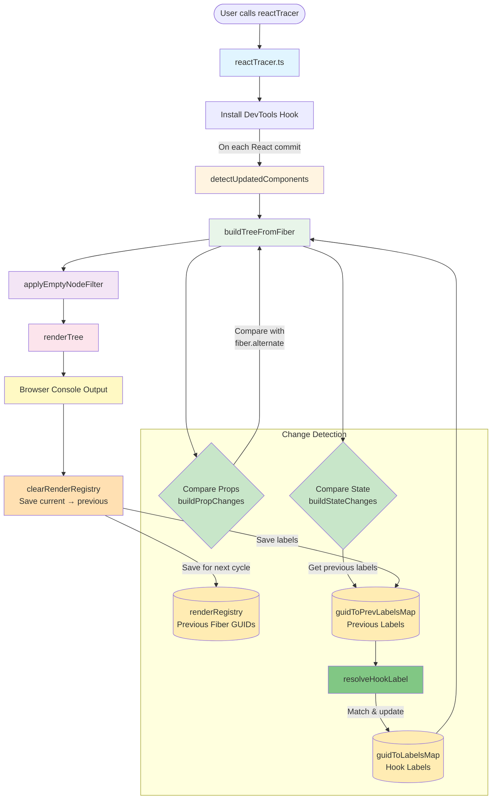
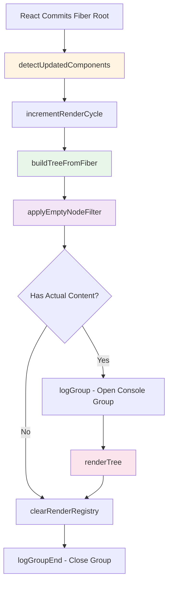
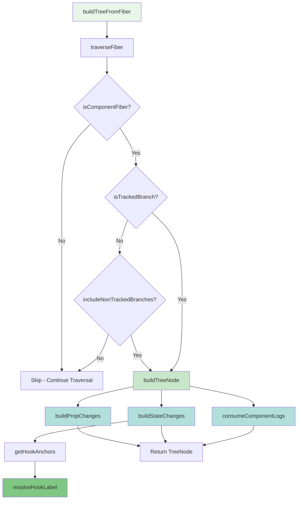
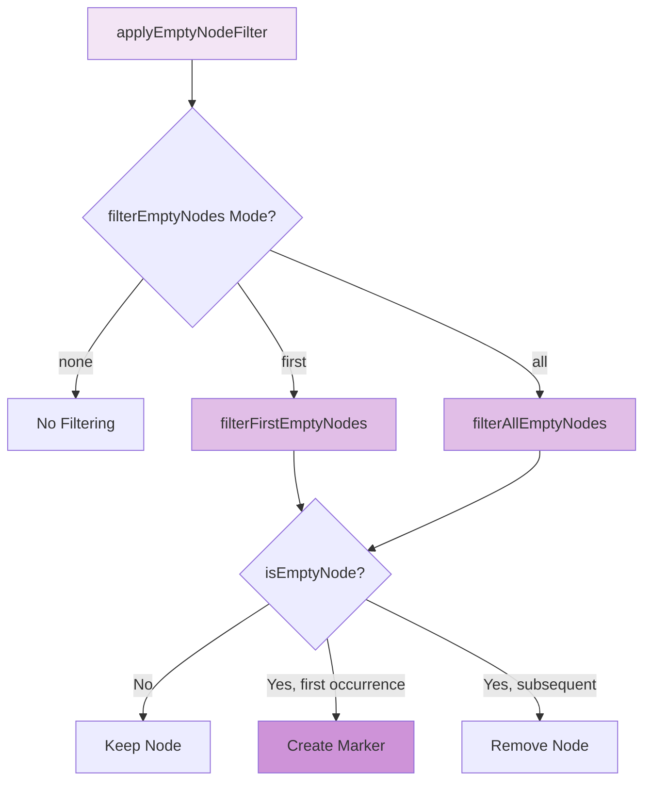
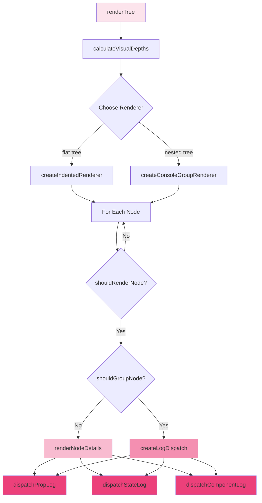
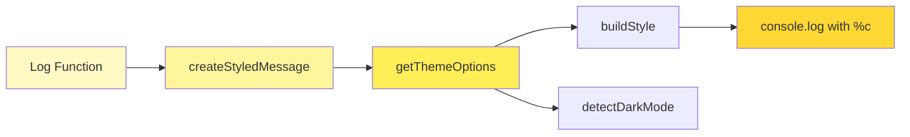
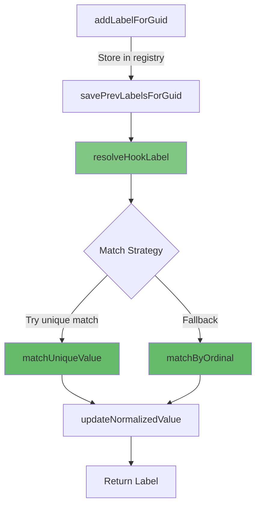
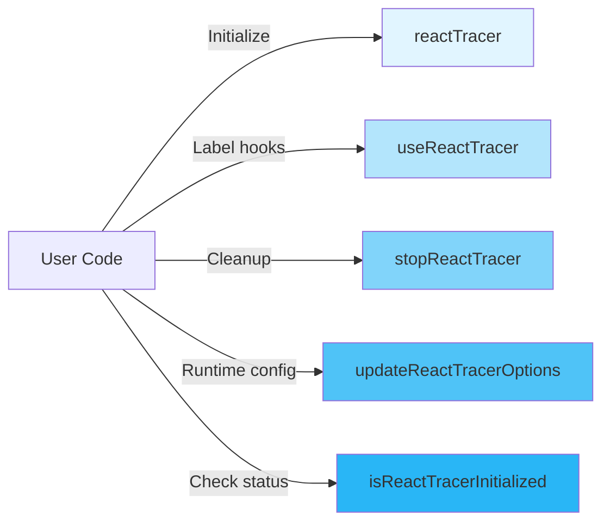

# @autotracer/react18 Architecture

This document provides a comprehensive overview of the `@autotracer/react18` package architecture, explaining how it intercepts React rendering, analyzes component changes, and produces formatted console output.

## High-Level Overview

The ReactTracer operates by hooking into React's internal DevTools API (`__REACT_DEVTOOLS_GLOBAL_HOOK__`) to receive notifications whenever React commits fiber updates. It maintains persistent state registries to track components across renders, enabling change detection by comparing current render data with previously stored snapshots. The system analyzes prop and state changes, resolves user-provided hook labels, and renders a styled tree view to the browser console.

**Core Flow:**

1. **Initialization** (`reactTracer.ts`): User calls `reactTracer()` before React renders
2. **Hook Installation**: Intercepts React's `onCommitFiberRoot` callback
3. **Component Detection** (`detectUpdatedComponents.ts`): Receives fiber root on each render cycle
4. **Tree Building** (`buildTreeFromFiber.ts`): Walks the fiber tree and builds TreeNode structures
5. **Change Detection**:
   - **Prop Changes** (`buildPropChanges`): Compares `fiber.memoizedProps` with `fiber.alternate.memoizedProps`
   - **State Changes** (`buildStateChanges`): Extracts current hook values, retrieves previous labels from `guidToPrevLabelsMap`
   - **Label Resolution** (`resolveHookLabel`): Matches current hooks to previous labels using structural/positional matching
6. **Filtering** (`applyEmptyNodeFilter.ts`): Removes nodes based on user configuration
7. **Rendering** (`renderTree.ts`): Outputs styled console logs for each node with detected changes
8. **State Persistence** (`clearRenderRegistry`): Saves current render data to registries for next cycle's comparison
9. **Console Display**: User sees formatted component tree with changes highlighted

**State Registries:**

- **`renderRegistry`**: Tracks fiber GUIDs that have been processed in current render
- **`guidToLabelsMap`**: Stores user-provided hook labels for current render
- **`guidToPrevLabelsMap`**: Stores previous render's labels for matching across renders
- **Fiber Alternate**: React's built-in previous fiber snapshot for prop comparison

---

## 1. Initialization and Hook Installation

The entry point is `reactTracer()`, which validates options, installs the DevTools hook, and returns a cleanup function.

```mermaid
flowchart LR
    User[User Application]
    ReactTracer[reactTracer]
    Validate[validateReactTracerOptions]
    Merge[deepMergeOptions]
    DevTools[DevTools Hook Check]
    Install[installRenderHook]
    Safe[createSafeRenderHook]

    User -->|calls| ReactTracer
    ReactTracer --> Validate
    Validate --> Merge
    Merge --> DevTools
    DevTools -->|if available| Install
    Install --> Safe
    Safe -->|wraps| detectUpdatedComponents

    style ReactTracer fill:#e1f5ff
    style Safe fill:#fff4e1
```

**Key Functions:**

- **`reactTracer(options)`** (`reactTracer.ts`): Main entry point

  - Validates and merges options with defaults via `validateReactTracerOptions` and `deepMergeOptions`
  - Checks for React DevTools hook availability via `isDevToolsAvailable`
  - Creates a safe wrapper via `createSafeRenderHook` that catches errors
  - Installs the hook via `installRenderHook`
  - Returns `stopReactTracer` cleanup function

- **`installRenderHook(safeRenderHook)`** (`devToolsUtils.ts`):

  - Accesses `window.__REACT_DEVTOOLS_GLOBAL_HOOK__.onCommitFiberRoot`
  - Saves original hook and replaces with wrapped version
  - Returns original hook for restoration

- **`createSafeRenderHook(callback)`** (`devToolsUtils.ts`):
  - Wraps user callback with try/catch to prevent crashes
  - Calls original DevTools hook first, then custom logic
  - Logs errors without breaking React rendering

---

## 2. Component Detection Pipeline

On each React commit, `detectUpdatedComponents` receives the fiber root and orchestrates the analysis pipeline.

**Key Function:**

- **`detectUpdatedComponents(root)`** (`detectUpdatedComponents.ts`):
  1. Increments render cycle counter via `incrementRenderCycle`
  2. Builds tree via `buildTreeFromFiber(rootNode.current, 0)`
  3. Applies filtering via `applyEmptyNodeFilter(filterMode)` returning filter function
  4. Executes filter function with include options for reconciled/skipped/mount/rendered nodes
  5. Opens console group if tree has actual content (not just markers)
  6. Calls `renderTree(filtered)` to output nodes
  7. Clears render registry via `clearRenderRegistry()`
  8. Closes console group

---

## 3. Tree Building from Fiber

The tree building phase walks React's fiber tree depth-first and constructs `TreeNode` objects with component analysis.

**Key Functions:**

- **`buildTreeFromFiber(fiber, depth)`** (`buildTreeFromFiber.ts`):

  - Entry point that delegates to `traverseFiber`
  - Returns array of `TreeNode` objects

- **`traverseFiber(fiber, depth, nodes, parentTracked)`** (`traverseFiber.ts`):

  - Recursive depth-first traversal of fiber tree
  - Checks `isComponentFiber(fiber)` to identify renderable components
  - Checks `isTrackedBranch(fiber, parentTracked)` to filter tracked fibers
  - Calls `buildTreeNode(fiber, depth)` for each tracked component
  - Recursively processes `child` and `sibling` fibers

- **`buildTreeNode(fiber, depth)`** (`buildTreeNode.ts`):

  - Extracts component name via `getRealComponentName(fiber)`
  - Determines render type via `determineRenderType(fiber.flags, fiber.alternate)`
  - Builds prop changes via `buildPropChanges(fiber.memoizedProps, fiber.alternate?.memoizedProps)`
  - Builds state changes via `buildStateChanges(fiber, guid)`
  - Consumes component logs via `consumeComponentLogs(guid)`
  - Returns `TreeNode` object with all analysis data

- **`buildPropChanges(currentProps, prevProps)`** (`buildPropChanges.ts`):

  - Compares current and previous props
  - Skips props in `skippedProps` set
  - Uses `areValuesIdentical` for deep structural comparison
  - Returns array of `PropChange` objects

- **`buildStateChanges(fiber, guid)`** (`buildStateChanges.ts`):

  - Extracts hook anchors via `getHookAnchors(fiber.memoizedState)`
  - Resolves hook labels via `resolveHookLabel` for each anchor
  - Compares current and previous state values
  - Returns array of `StateChange` objects with resolved labels

- **`getHookAnchors(memoizedState)`** (`getHookAnchors.ts`):

  - Walks the hook chain (linked list via `next` pointers)
  - Extracts state values from stateful hooks (useState, useReducer, etc.)
  - Returns array of anchor values representing current state

- **`resolveHookLabel(guid, anchorValue, anchorIndex)`** (`resolveHookLabel.ts`):
  - Attempts to match current anchor to previous labeled hooks
  - Uses `matchUniqueValue` for unique structural matches
  - Uses `matchByOrdinal` as fallback for positional matching
  - Returns user-provided label or auto-generated label

---

## 4. Filtering

After building the tree, nodes are filtered based on user configuration to reduce noise.

**Key Functions:**

- **`applyEmptyNodeFilter(mode)`** (`applyEmptyNodeFilter.ts`):

  - Returns filter function based on mode: `none`, `first`, or `all`
  - Filter function takes nodes array and include options
  - Returns filtered array of `TreeNode` objects

- **`filterFirstEmptyNodes(nodes, options)`** (`filterFirstEmptyNodes.ts`):

  - Replaces first occurrence of each empty node type with a marker
  - Removes subsequent empty nodes of same type
  - Uses `isEmptyNode` to determine if node should be filtered

- **`filterAllEmptyNodes(nodes, options)`** (`filterAllEmptyNodes.ts`):

  - Removes all empty nodes entirely
  - No markers created

- **`isEmptyNode(node, options)`** (`isEmptyNode.ts`):

  - Returns true if node has no prop changes, no state changes, no component logs
  - Checks render type against include options (reconciled, skipped, mount, rendered)
  - Nodes are "empty" if they don't represent meaningful changes

- **`createMarkerNode(reason, count)`** (`createMarkerNode.ts`):
  - Creates special TreeNode with `renderType: "Marker"`
  - Displays summary like "3 reconciled components filtered"

---

## 5. Tree Rendering

The final step renders the filtered tree to the browser console with styled output.

**Key Functions:**

- **`renderTree(nodes)`** (`renderTree.ts`):

  - Calculates visual depths via `calculateVisualDepths(nodes)`
  - Chooses renderer: `createIndentedRenderer()` or `createConsoleGroupRenderer()`
  - Iterates through nodes calling renderer methods

- **`calculateVisualDepths(nodes)`** (`calculateVisualDepths.ts`):

  - Assigns visual depth for indentation
  - Accounts for filtered parent nodes to maintain visual hierarchy

- **`createIndentedRenderer()`** (`createIndentedRenderer.ts`):

  - Renders flat tree with indentation based on visual depth
  - Uses `renderIndentedNode(node, prefix, visualDepth)`
  - Calls `renderNodeDetails(node, prefix)` for each node

- **`createConsoleGroupRenderer()`** (`createConsoleGroupRenderer.ts`):

  - Renders nested tree using `console.group()` / `console.groupEnd()`
  - Opens/closes groups based on node depth changes
  - Uses `computeCloseCount` to determine how many groups to close

- **`renderNodeDetails(node, prefix)`** (`renderNodeDetails.ts`):

  - Renders component header with name and render type
  - Calls detail renderers for props, state, and logs

- **`createLogDispatch(node)`** (`createLogDispatch.ts`):

  - Creates dispatch object that routes to specific loggers
  - Returns functions for prop logs, state logs, component logs

- **`dispatchPropLog(change, node)`** (`dispatchPropLog.ts`):

  - Determines if prop change is identical (warning) or actual change
  - Calls `logPropChange` or `logIdenticalPropValueWarning`

- **`dispatchStateLog(change, node)`** (`dispatchStateLog.ts`):

  - Determines if state change is identical (warning) or actual change
  - Calls `logStateChange` or `logIdenticalStateValueWarning`

- **`dispatchComponentLog(entry, node)`** (`dispatchComponentLog.ts`):
  - Routes component logs (log, warn, error) to appropriate styled loggers
  - Calls `logLogStatement`, `logWarnStatement`, or `logErrorStatement`

---

## 6. Styled Console Output

All console output uses styled logging functions that apply CSS styling and theming.

**Key Functions:**

- **`logPropChange(name, before, after, node)`** (`logPropChange.ts`):

  - Formats prop change message
  - Calls `createStyledMessage` with theme and message parts
  - Uses `console.log` with `%c` placeholders for styling

- **`logStateChange(label, before, after, node)`** (`logStateChange.ts`):

  - Formats state change message
  - Similar styling approach as prop changes

- **`createStyledMessage(parts, options)`** (`createStyledMessage.ts`):

  - Takes message parts and styling metadata
  - Builds format string with `%c` placeholders
  - Returns `[formatString, ...styleArgs]` for console.log

- **`getThemeOptions(renderType)`** (`themeManager.ts`):

  - Returns theme configuration based on render type (Rendered, Reconciled, Skipped, Mount)
  - Detects dark/light mode via `detectDarkMode()`
  - Merges user theme overrides

- **`buildStyle(themeOptions)`** (`themeManager.ts`):

  - Converts theme options to CSS string
  - Applies colors, fonts, backgrounds, etc.

- **`detectDarkMode()`** (`themeManager.ts`):
  - Checks `window.matchMedia('(prefers-color-scheme: dark)')`
  - Returns boolean for dark mode detection
  - Respects Chrome's Appearance Mode setting (`chrome://settings/appearance` → Mode)

---

## 7. Hook Label Resolution

Hook labels allow developers to assign friendly names to hooks, which are then resolved during tree building.

**Key Functions:**

- **`addLabelForGuid(guid, entry)`** (`addLabelForGuid.ts`):

  - Stores label entry in `guidToLabelsMap`
  - Called by `useReactTracer` hook when user labels hooks

- **`savePrevLabelsForGuid(guid)`** (`savePrevLabelsForGuid.ts`):

  - Copies current labels to `guidToPrevLabelsMap` before render
  - Allows comparison between renders

- **`resolveHookLabel(guid, anchorValue, anchorIndex)`** (`resolveHookLabel.ts`):

  - Gets previous labels via `getPrevLabelsForGuid(guid)`
  - Attempts `matchUniqueValue` for structural matching
  - Falls back to `matchByOrdinal` for positional matching
  - Calls `updateNormalizedValue` to store normalized value for next render
  - Returns matched label or generates default label

- **`matchUniqueValue(anchorValue, prevLabels)`** (`matchUniqueValue.ts`):

  - Normalizes anchor value via `normalizeValue`
  - Compares with normalized values of previous labels
  - Returns label if exactly one match found

- **`matchByOrdinal(anchorIndex, prevLabels)`** (`matchByOrdinal.ts`):

  - Matches based on hook chain position (index)
  - Simple fallback when structural matching fails

- **`updateNormalizedValue(guid, anchorIndex, anchorValue)`** (`updateNormalizedValue.ts`):
  - Updates normalized value in label entry
  - Prepares for next render's matching

---

## 8. Public API

The package exports a minimal public API for user integration.

**Exported Functions:**

- **`reactTracer(options)`** (`reactTracer.ts`):

  - Initializes the global render monitor
  - Returns cleanup function

- **`useReactTracer()`** (`useReactTracer.ts`):

  - React hook for labeling component hooks
  - Returns `ComponentLogger` object with methods:
    - `labelState(label, value)`: Label a state value
    - `log(message)`: Log a message associated with this render
    - `warn(message)`: Warn message
    - `error(message)`: Error message

- **`stopReactTracer()`** (`reactTracer.ts`):

  - Restores original DevTools hook
  - Cleans up state

- **`updateReactTracerOptions(options)`** (`reactTracer.ts`):

  - Updates configuration at runtime
  - Merges with current options

- **`isReactTracerInitialized()`** (`reactTracer.ts`):
  - Returns boolean indicating if tracer is active

**Exported Types:**

- **`ReactTracerOptions`**: Configuration object
- **`SkippedObjectProp`**: Prop name or matcher for skipping
- **`ComponentLogEntry`**: Log/warn/error entry structure
- **`ComponentLogger`**: Return type of `useReactTracer`

---

## Summary

The ReactTracer package provides automated React component render tracking by:

1. **Hooking** into React's DevTools API to receive fiber commits
2. **Analyzing** each fiber's props, state, and flags to determine changes
3. **Resolving** user-provided hook labels via structural/positional matching
4. **Filtering** nodes based on user configuration to reduce noise
5. **Rendering** a styled tree view to the browser console with highlighted changes

The architecture is designed for minimal performance impact, clear separation of concerns, and extensibility for future enhancements.
