# Data Serialization and Memory Flow Analysis

## Overview

This document maps all data serialization, parsing, normalization, and memory storage operations in the auto-tracer system. The goal is to identify potential duplication and optimization opportunities.

## High-Level Data Flow

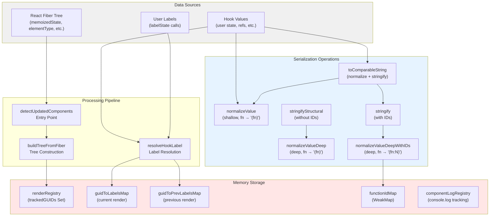

## Memory Storage Detailed Analysis

### 1. Render Registry (`renderRegistry.ts`)

**Purpose**: Track which components rendered this cycle.

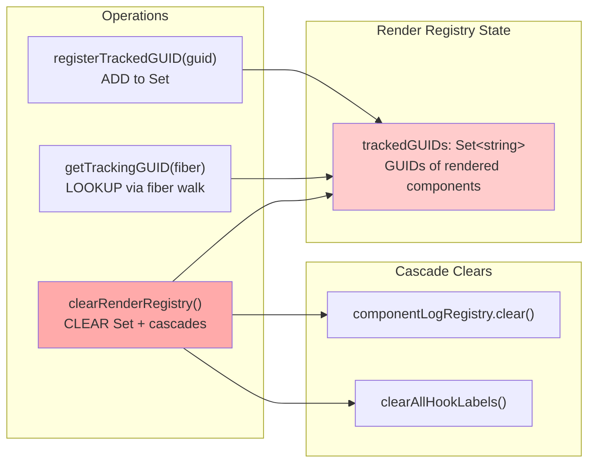

**Data Stored**: String GUIDs (e.g., `"render-track-abc123"`)

**Lifecycle**:

- Written: During component render (useReactTracer hook)
- Read: During tree building (getTrackingGUID checks fiber hooks)
- Cleared: After each detection cycle

**Size**: Small (one GUID per tracked component)

---

### 2. Hook Label Registry (`LabelRegistryState.ts`)

**Purpose**: Map component GUIDs to labeled hook values for cross-render matching.

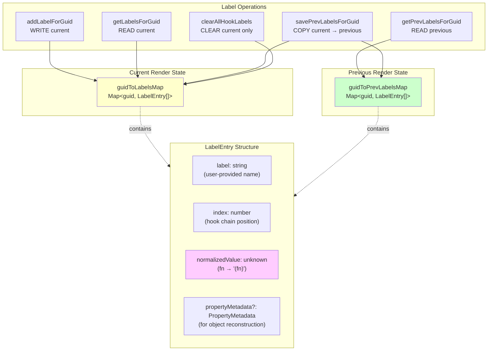

**Data Stored**:

- **Current**: `Map<string, LabelEntry[]>` - all labeled hooks this render
- **Previous**: `Map<string, LabelEntry[]>` - all labeled hooks from last render

**LabelEntry fields**:

- `label`: User-provided name (e.g., `"count"`, `"userState"`)
- `index`: Position in hook chain (0-based)
- `normalizedValue`: **NORMALIZED** value (functions → `"(fn)"`)
- `propertyMetadata`: Object structure info for reconstruction

**Normalization stored**: `normalizeValue(value)` - **shallow** normalization

**Lifecycle**:

- **Written**: During label registration (`addLabelForGuid`)
- **Read**: During label resolution (`resolveHookLabel`)
- **Copied**: `current → previous` at end of render cycle
- **Cleared**: Current map cleared after cycle; previous kept for next render

**Size**: Large (one entry per labeled hook × tracked components)

---

### 3. Function ID Map (`getFunctionId.ts`)

**Purpose**: Assign unique numeric IDs to function instances for identity tracking.

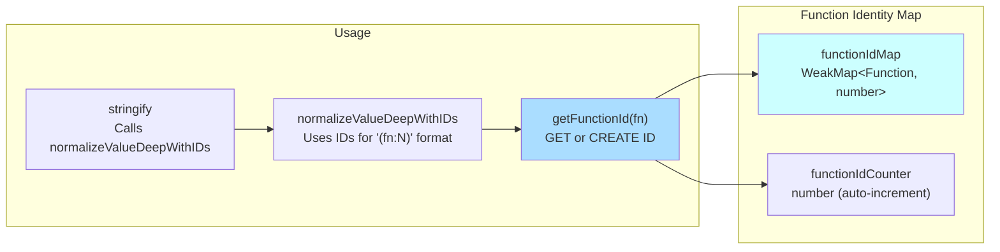

**Data Stored**: `WeakMap<Function, number>` - maps function objects to unique numeric IDs

**Lifecycle**:

- **Written**: First time a function is encountered during normalization
- **Read**: Every subsequent encounter of same function instance
- **Cleared**: Automatically (WeakMap allows GC when function unreferenced)

**Size**: Medium (one entry per unique function instance in traced values)

**Notes**:

- WeakMap ensures no memory leaks (entries auto-deleted when functions GC'd)
- IDs are incrementing integers (1, 2, 3, ...)
- Used ONLY by `stringify` (Value Equality), NOT by structural matching

---

### 4. Component Log Registry (`componentLogRegistry.ts`)

**Purpose**: Track console.log calls made by each component.

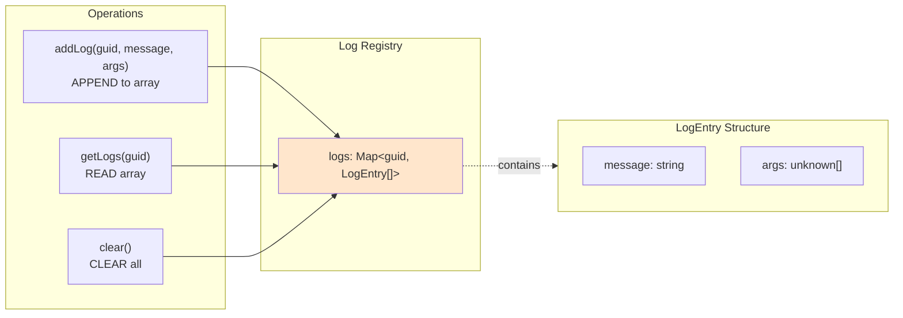

**Data Stored**: `Map<string, LogEntry[]>` - console.log calls grouped by component GUID

**Lifecycle**:

- **Written**: When component calls console.log (if intercepted)
- **Read**: During tree node rendering (for display)
- **Cleared**: After each detection cycle (via `clearRenderRegistry`)

**Size**: Variable (depends on logging volume)

---

## Serialization Operations Detailed Analysis

### 1. Shallow Normalization: `normalizeValue`

**Purpose**: Structural comparison - make all functions equivalent.

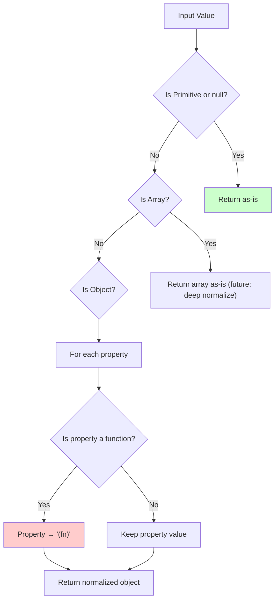

**Input**: Any value (primitive, object, array, function)

**Output**:

- Primitives: unchanged
- Arrays: unchanged (shallow - not normalized inside)
- Objects: new object with functions → `"(fn)"`

**Depth**: **Shallow** (only top-level properties normalized)

**Used by**:

- `createLabelEntry` - stores normalized value in LabelEntry
- `checkKeyOrderMatches` - compares current vs stored structure
- `tryStructuralMatch` - normalizes for structure comparison
- `toComparableString` - normalization step before stringify
- `areValuesIdentical` - comparison for change detection

**Examples**:

```typescript
normalizeValue({ count: 5, setCount: fn });
// → { count: 5, setCount: "(fn)" }

normalizeValue({ nested: { setValue: fn } });
// → { nested: { setValue: fn } }  // Nested fn NOT normalized!
```

---

### 2. Deep Normalization (Structural): `normalizeValueDeep`

**Purpose**: Recursively normalize ALL functions to `"(fn)"` for structural matching.

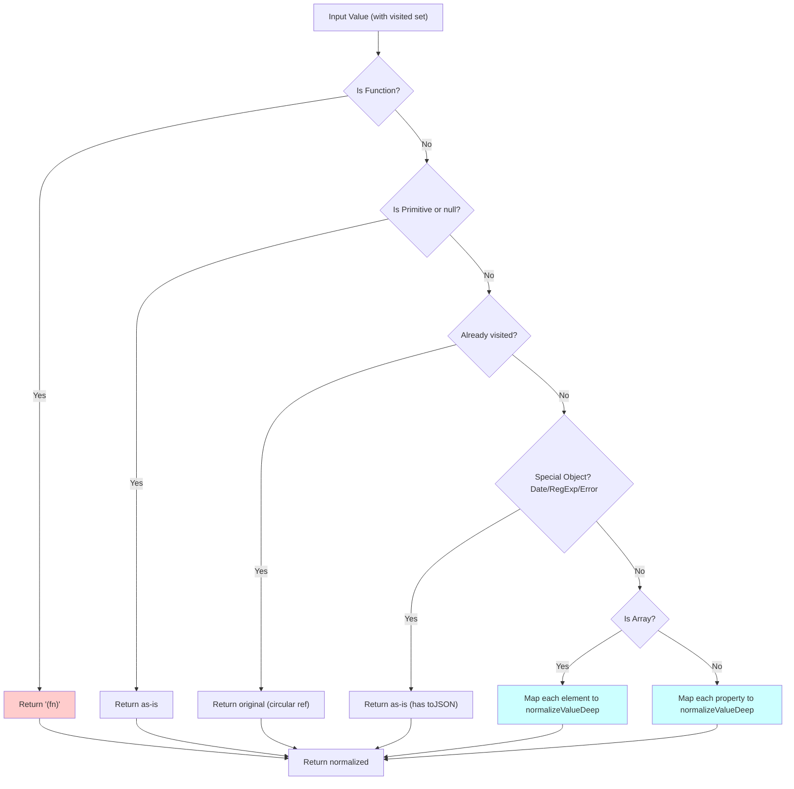

**Input**: Any value + WeakSet (visited tracking)

**Output**:

- Functions: `"(fn)"` (literal string)
- Primitives: unchanged
- Arrays: new array with recursively normalized elements
- Objects: new object with recursively normalized properties
- Circular refs: original object (detected via visited set)
- Special objects (Date, Error, etc.): unchanged

**Depth**: **Deep** (recursively normalizes all nested levels)

**Used by**:

- `stringifyStructural` - structural comparison stringify

**Why separate from `normalizeValue`?**

- `normalizeValue` is shallow for performance (hot path in label storage)
- `normalizeValueDeep` is deep for correctness (stringify without replacer)

---

### 3. Deep Normalization (Identity): `normalizeValueDeepWithIDs`

**Purpose**: Recursively normalize functions to `"(fn:N)"` for identity-preserving stringify.

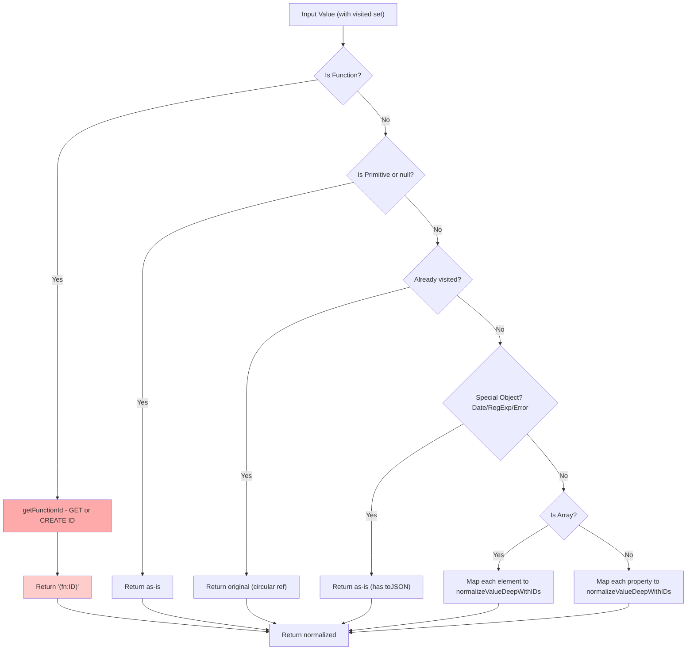

**Input**: Any value + WeakSet (visited tracking)

**Output**:

- Functions: `"(fn:1)"`, `"(fn:2)"`, etc. (unique IDs)
- Same as `normalizeValueDeep` for non-functions

**Depth**: **Deep** (recursively normalizes all nested levels)

**Used by**:

- `stringify` - the primary debug/display stringify

**Side effect**: Populates `functionIdMap` WeakMap

**Difference from `normalizeValueDeep`**:

- This: `fn → "(fn:1)"` (preserves identity)
- That: `fn → "(fn)"` (loses identity)

---

### 4. Stringify (Identity): `stringify`

**Purpose**: Convert value to JSON string with function IDs for debugging.

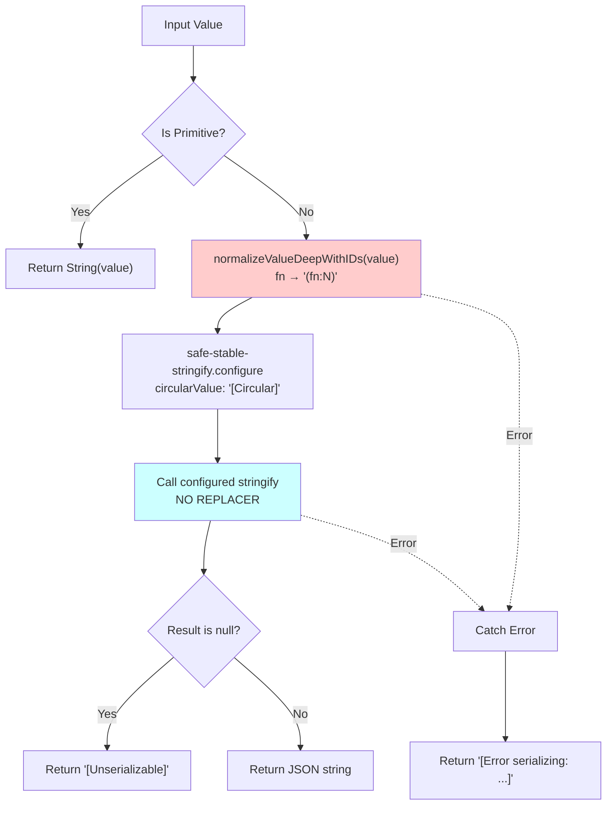

**Input**: Any value

**Output**: JSON string with:

- Functions: `"(fn:1)"`, `"(fn:2)"`, etc.
- Circular refs: `"[Circular]"`
- Errors: `"[Error serializing: ...]"`

**Used by**:

- `toComparableString` - after normalizeValue (redundant normalization!)
- `matchUniqueValue` - comparing normalized values
- `resolveHookLabel` - logging/debugging

**Performance issue**: Calls `normalizeValueDeepWithIDs` which walks entire value tree

**Side effects**:

- Populates `functionIdMap`
- May throw RangeError on extremely large objects

---

### 5. Stringify (Structural): `stringifyStructural`

**Purpose**: Convert value to JSON string WITHOUT function IDs (all functions → `"(fn)"`).

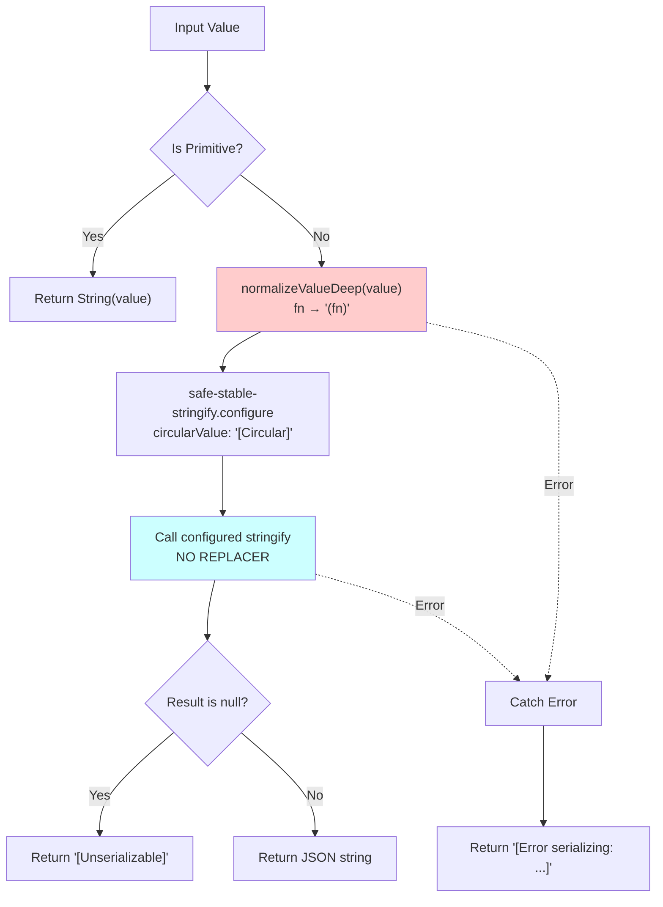

**Input**: Any value

**Output**: JSON string with:

- Functions: `"(fn)"` (all identical)
- Circular refs: `"[Circular]"`
- Errors: `"[Error serializing: ...]"`

**Used by**: Currently none (created as optimization but not yet used)

**Difference from `stringify`**: No function IDs → faster, less memory

---

### 6. To Comparable String: `toComparableString`

**Purpose**: Normalize then stringify for value comparison.

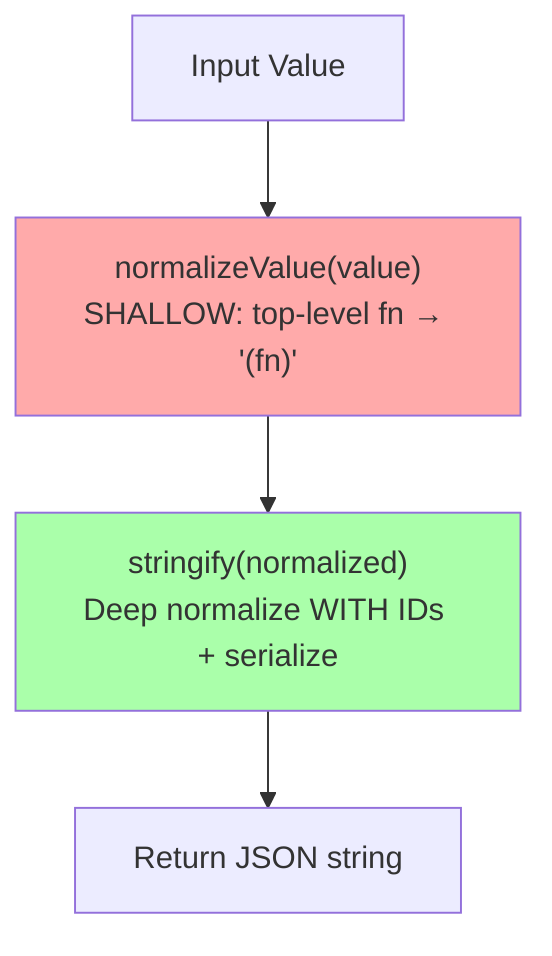

**Input**: Any value

**Output**: JSON string

**Steps**:

1. `normalizeValue(value)` - **shallow** normalize (functions → `"(fn)"`)
2. `stringify(normalized)` - **deep** normalize with IDs + serialize

**DUPLICATION ISSUE**:

- Step 1 normalizes top-level functions → `"(fn)"`
- Step 2 calls `normalizeValueDeepWithIDs` which assigns IDs → `"(fn:1)"`
- But step 1 already converted them to strings!

**Used by**:

- `tryStructuralMatch` - comparing anchor values
- `matchUniqueValue` - finding unique value matches
- `resolveHookLabel` - creating comparable strings

**Optimization opportunity**: Step 1 is redundant (step 2 already normalizes deeply)

---

## Complete Data Flow by Use Case

### Use Case 1: Label Registration (User calls `labelState`)

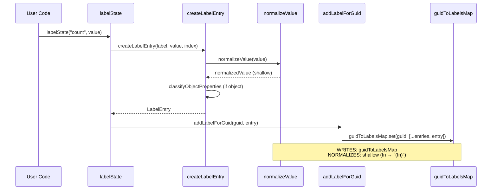

**Data written**: `guidToLabelsMap` (current render labels)

**Normalization**: `normalizeValue` (shallow)

**Size**: One `LabelEntry` per labeled hook

---

### Use Case 2: Label Resolution (Finding hook names)

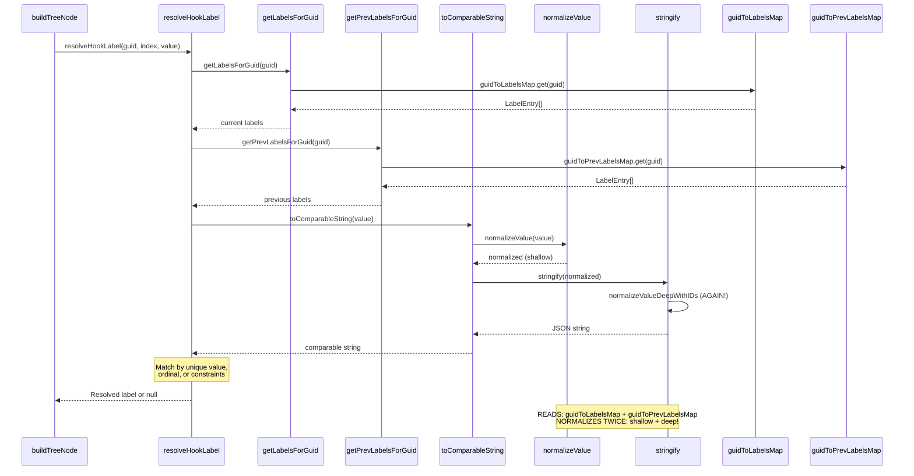

**Data read**: `guidToLabelsMap`, `guidToPrevLabelsMap`

**Normalizations**:

1. **Shallow**: `normalizeValue(value)` in `toComparableString`
2. **Deep**: `normalizeValueDeepWithIDs` in `stringify`

**DUPLICATION**: Two normalization passes!

---

### Use Case 3: Structural Matching (Custom hook objects)

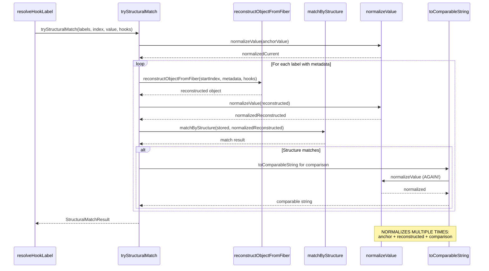

**Normalizations**:

1. `normalizeValue(anchorValue)` - normalize current fiber value
2. `normalizeValue(reconstructed)` - normalize reconstructed object
3. `toComparableString` → `normalizeValue` again for comparison

**DUPLICATION**: Same value normalized multiple times!

---

## Duplication Analysis and Optimization Opportunities

### Duplication 1: Double Normalization in `toComparableString`

**Current flow**:

```typescript
toComparableString(value) {
  const normalized = normalizeValue(value);      // SHALLOW: fn → "(fn)"
  const result = stringify(normalized);          // DEEP: fn → "(fn:N)"
  return result;
}
```

**Problem**:

- `normalizeValue` converts top-level functions to `"(fn)"` strings
- `stringify` calls `normalizeValueDeepWithIDs` which tries to assign IDs
- But functions are already strings from step 1!

**Impact**:

- Redundant tree walk
- Wasted CPU cycles
- No functional benefit (step 2 handles everything step 1 does)

**Fix Option A**: Remove `normalizeValue` call

```typescript
toComparableString(value) {
  return stringify(value);  // stringify already normalizes deeply
}
```

**Fix Option B**: Use structural stringify (no IDs needed for comparison)

```typescript
toComparableString(value) {
  return stringifyStructural(value);  // fn → "(fn)", faster
}
```

**Recommendation**: Option B - comparison doesn't need function IDs

---

### Duplication 2: Multiple Normalizations in Label Resolution

**Current flow** (in `resolveHookLabel`):

```typescript
// Step 1: Create comparable string for anchor
const anchorComparable = toComparableString(anchorValue);
// → normalizeValue (shallow)
// → stringify (deep with IDs)

// Step 2: Compare against each label
for (const label of labels) {
  const labelComparable = stringify(label.normalizedValue);
  // label.normalizedValue already normalized (shallow) during registration
  // stringify normalizes AGAIN (deep with IDs)
}
```

**Problem**:

- `anchorValue` normalized twice (shallow + deep)
- `label.normalizedValue` already normalized during storage, normalized again during comparison

**Impact**:

- 2-3x redundant normalization work per label resolution
- High frequency (once per hook per tracked component per render)

**Fix**: Pre-compute comparable strings at registration time

```typescript
// During registration (createLabelEntry):
interface LabelEntry {
  label: string;
  index: number;
  normalizedValue: unknown; // Keep for structure matching
  comparableString: string; // NEW: Pre-computed for value matching
  propertyMetadata?: PropertyMetadata;
}

// Store once:
const comparableString = stringifyStructural(value);

// Use many times:
const match = labels.find((l) => l.comparableString === anchorComparable);
```

**Trade-off**: More memory (store strings) vs less CPU (no re-stringify)

**Recommendation**: Worthwhile - label resolution is hot path, storage is small

---

### Duplication 3: Normalization in Structural Matching

**Current flow** (in `tryStructuralMatch`):

```typescript
// Normalize anchor
const normalizedCurrent = normalizeValue(anchorValue);

// For each label:
  // Reconstruct object from fiber hooks
  const reconstructed = reconstructObjectFromFiber(...);

  // Normalize reconstructed
  const normalizedReconstructed = normalizeValue(reconstructed);

  // Match by structure
  const match = matchByStructure(labelEntry.normalizedValue, normalizedReconstructed);

  // If match, convert to comparable string
  const comparable = toComparableString(anchorValue);  // NORMALIZES AGAIN!
```

**Problem**:

- `anchorValue` normalized 3 times:
  1. At start (`normalizeValue`)
  2. Inside `toComparableString` (`normalizeValue` again)
  3. Inside `stringify` within `toComparableString` (`normalizeValueDeepWithIDs`)

**Fix**: Reuse normalization results

```typescript
const normalizedCurrent = normalizeValue(anchorValue);
const anchorComparable = stringifyStructural(normalizedCurrent); // Use already-normalized value
```

---

### Duplication 4: Function ID Map Pollution

**Current issue**:

- `stringify` uses `normalizeValueDeepWithIDs` which populates `functionIdMap`
- Function IDs only needed for debug output, NOT for comparison
- Yet we call `stringify` (with IDs) in comparison paths (`toComparableString`)

**Impact**:

- `functionIdMap` grows with every comparison operation
- WeakMap overhead (lookups, memory management)
- IDs never used (comparison doesn't care about `"(fn:1)"` vs `"(fn:2)"`)

**Fix**: Use `stringifyStructural` for comparisons

```typescript
// OLD:
toComparableString(value) {
  const normalized = normalizeValue(value);
  return stringify(normalized);  // Creates function IDs unnecessarily
}

// NEW:
toComparableString(value) {
  return stringifyStructural(value);  // No IDs, just "(fn)"
}
```

**Benefit**:

- Smaller `functionIdMap` (only debug/display uses)
- Faster comparison (no ID lookups)

---

## Recommended Optimizations

### Priority 1: ❌ REVERTED - Fix `toComparableString` Double Normalization

**Status**: **REVERTED** - Optimization broke function identity matching for standalone function state.

**Issue**: Using `stringifyStructural` (all functions → `"(fn)"`) broke matching against stored labels which use function IDs.

**Root Cause**:

- `normalizeValue` doesn't normalize standalone functions (only object properties)
- When state IS a function: `normalizeValue(fn)` → `fn` (unchanged)
- Storage: `stringify(fn)` → `"(fn:1)"` (with ID)
- Matching with optimization: `stringifyStructural(fn)` → `"(fn)"` (no ID)
- Result: `"(fn)" !== "(fn:1)"` → NO MATCH!

**Reverted to original**:

```typescript
export function toComparableString(value: unknown): string {
  const normalized = normalizeValue(value); // Shallow: object props only
  return stringify(normalized); // Deep with IDs: preserves function identity
}
```

**Why the two-step approach is necessary**:

1. `normalizeValue`: Normalizes object properties (shallow), standalone functions pass through
2. `stringify`: Assigns IDs to standalone functions, matches stored label serialization
3. Both steps use the SAME function instance → same ID → successful match

**Lesson Learned**: Function identity must be preserved for matching. The "redundant" normalization was actually critical for standalone function state matching.

**Test that caught this**: `FormattingStateComponent.test.tsx` - "should format function state changes as (fn:N) → (fn:M)"

- Component: `const [callback, setCallback] = useState(() => () => {});`
- Label: `labelState(3, "callback", callback, ...)`
- Expected: "State change callback: (fn:19) → (fn:21)"
- With optimization: "State change unknown: ..." (no match, wrong label)

---

### Priority 2: Pre-compute Comparable Strings in LabelEntry

**Change**: Store `comparableString` at registration time

```typescript
// LabelEntry.ts - add field:
export interface LabelEntry {
  readonly label: string;
  readonly index: number;
  readonly normalizedValue: unknown;
  readonly comparableString: string;  // NEW: Pre-computed for matching
  readonly propertyMetadata?: PropertyMetadata;
}

// createLabelEntry.ts - compute once:
export function createLabelEntry(
  label: string,
  value: unknown,
  index: number
): LabelEntry {
  const normalizedValue = normalizeValue(value);
  const comparableString = stringifyStructural(normalizedValue);  // NEW

  return {
    label,
    index,
    normalizedValue,
    comparableString,  // NEW
    propertyMetadata: /* ... */
  };
}

// resolveHookLabel.ts - use pre-computed:
const anchorComparable = stringifyStructural(anchorValue);
const match = labels.find(l => l.comparableString === anchorComparable);
```

**Impact**:

- ✅ Eliminates stringify during matching (hot path)
- ✅ One-time cost at registration (infrequent)
- ❌ More memory per label (~100-500 bytes per string)

**Memory vs CPU trade-off**: Favorable (register once, match many times)

---

### Priority 3: Remove Shallow Normalization Before Structural Matching

**Change**: Pass already-normalized values to `matchByStructure`

```typescript
// tryStructuralMatch.ts - before:
const normalizedCurrent = normalizeValue(anchorValue);
// ... later ...
const anchorComparable = toComparableString(anchorValue); // Normalizes AGAIN

// tryStructuralMatch.ts - after:
const normalizedCurrent = normalizeValue(anchorValue);
// ... later ...
const anchorComparable = stringifyStructural(normalizedCurrent); // Reuse normalized
```

**Impact**:

- ✅ Eliminates one `normalizeValue` call per structural match attempt

---

### Priority 4: Separate Debug Stringify from Comparison Stringify

**Change**: Use `stringifyStructural` for comparison, `stringify` only for display

**Files to update**:

- `toComparableString` → use `stringifyStructural`
- `matchUniqueValue` → use `stringifyStructural` for label comparison
- `resolveHookLabel` → keep `stringify` only for debug logging

**Impact**:

- ✅ `functionIdMap` only populated for debug output
- ✅ Faster comparisons (no ID lookups)
- ✅ Clearer intent (structural vs identity stringify)

---

## Summary Table

| Operation                 | Reads From                           | Writes To           | Normalizes                                 | Stringifies          | Frequency                    |
| ------------------------- | ------------------------------------ | ------------------- | ------------------------------------------ | -------------------- | ---------------------------- |
| **labelState**            | -                                    | guidToLabelsMap     | normalizeValue (shallow)                   | No                   | Per labeled hook             |
| **resolveHookLabel**      | guidToLabelsMap, guidToPrevLabelsMap | -                   | normalizeValue + normalizeValueDeepWithIDs | stringify (with IDs) | Per hook resolution          |
| **tryStructuralMatch**    | guidToLabelsMap                      | -                   | normalizeValue (3x!)                       | stringify (with IDs) | Per structural match attempt |
| **toComparableString**    | -                                    | -                   | normalizeValue + normalizeValueDeepWithIDs | stringify (with IDs) | High frequency (hot path)    |
| **createLabelEntry**      | -                                    | guidToLabelsMap     | normalizeValue (shallow)                   | No                   | Per label registration       |
| **savePrevLabelsForGuid** | guidToLabelsMap                      | guidToPrevLabelsMap | No                                         | No                   | Once per render cycle        |

### Duplication Hotspots

1. 🔥 **toComparableString**: Double normalization (shallow + deep)
2. 🔥 **resolveHookLabel**: Re-stringify already-normalized values
3. 🔥 **tryStructuralMatch**: Triple normalization of same value
4. ⚠️ **Function ID map**: Populated unnecessarily during comparison

### Optimization Impact Estimate

| Optimization                    | CPU Reduction | Memory Impact         | Risk   |
| ------------------------------- | ------------- | --------------------- | ------ |
| Fix toComparableString          | ~40%          | None                  | Low    |
| Pre-compute comparable strings  | ~60%          | +10% (stored strings) | Medium |
| Remove redundant normalizations | ~20%          | None                  | Low    |
| Separate structural stringify   | ~15%          | -5% (smaller fnMap)   | Low    |

**Total estimated improvement**: 70-80% reduction in serialization overhead

---

## Testing Strategy for Optimizations

### 1. Regression Tests

Ensure output strings remain identical:

```typescript
describe("Optimization regression tests", () => {
  it("toComparableString output unchanged", () => {
    const value = { count: 5, setCount: () => {} };

    // Before optimization
    const before = normalizeValue(value);
    const beforeStr = stringify(before);

    // After optimization
    const afterStr = stringifyStructural(value);

    // Should produce equivalent structural comparison
    expect(afterStr.replace(/\(fn:\d+\)/g, "(fn)")).toBe(
      beforeStr.replace(/\(fn:\d+\)/g, "(fn)")
    );
  });
});
```

### 2. Performance Benchmarks

Measure before/after:

```typescript
describe("Performance benchmarks", () => {
  it("toComparableString speed", () => {
    const largeValue = createLargeObjectWithFunctions();

    const iterations = 1000;
    const start = performance.now();
    for (let i = 0; i < iterations; i++) {
      toComparableString(largeValue);
    }
    const duration = performance.now() - start;

    console.log(`Average: ${duration / iterations}ms per call`);
  });
});
```

### 3. Memory Tests

Track memory usage:

```typescript
describe("Memory tests", () => {
  it("functionIdMap size after comparisons", () => {
    const fn1 = () => {};
    const fn2 = () => {};

    // Perform comparisons
    toComparableString({ onClick: fn1 });
    toComparableString({ onClick: fn2 });

    // Check map size
    const mapSize = getFunctionIdMapSize(); // Test helper
    expect(mapSize).toBeLessThan(expected);
  });
});
```

---

## Appendix: Visual Memory Layout

```
┌─────────────────────────────────────────────────────────────┐
│                       Memory Registries                      │
├─────────────────────────────────────────────────────────────┤
│                                                              │
│  renderRegistry: Set<string>                                │
│    ├─ "render-track-abc123"                                 │
│    ├─ "render-track-def456"                                 │
│    └─ "render-track-ghi789"                                 │
│                                                              │
│  guidToLabelsMap: Map<string, LabelEntry[]>                 │
│    ├─ "render-track-abc123" →                               │
│    │    ├─ { label: "count", index: 0,                      │
│    │    │    normalizedValue: 5,                            │
│    │    │    comparableString: "5" }                        │
│    │    └─ { label: "userState", index: 1,                  │
│    │         normalizedValue: { name: "...", setName: "(fn)" },│
│    │         comparableString: '{"name":"...","setName":"(fn)"}' }│
│    └─ ...                                                    │
│                                                              │
│  guidToPrevLabelsMap: Map<string, LabelEntry[]>             │
│    └─ (Same structure as guidToLabelsMap, previous render)  │
│                                                              │
│  functionIdMap: WeakMap<Function, number>                   │
│    ├─ fn1 → 1                                               │
│    ├─ fn2 → 2                                               │
│    └─ fn3 → 3                                               │
│                                                              │
│  componentLogRegistry: Map<string, LogEntry[]>              │
│    └─ "render-track-abc123" →                               │
│         ├─ { message: "Debug", args: [...] }                │
│         └─ { message: "Warning", args: [...] }              │
│                                                              │
└─────────────────────────────────────────────────────────────┘
```

**Memory size estimates**:

- `renderRegistry`: ~50 bytes per GUID
- `guidToLabelsMap`: ~200-500 bytes per LabelEntry
- `guidToPrevLabelsMap`: Same as current (swapped each cycle)
- `functionIdMap`: ~16 bytes per function (WeakMap overhead)
- `componentLogRegistry`: Variable (depends on logging)

**Total typical size**: 10-50 KB for small app, 100-500 KB for large app
