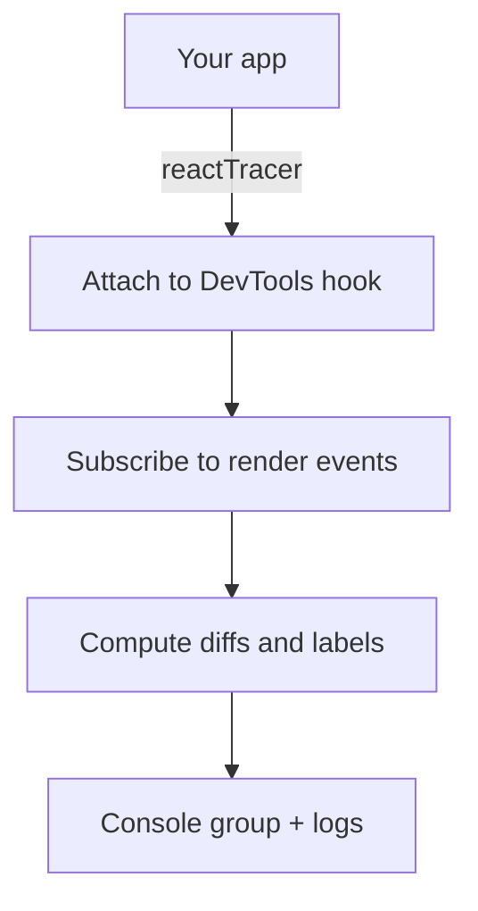

# @autotracer/react18

**Automatic React render tracing with labeled state and prop changes.**

See exactly what React is doing—component lifecycles, mount events, state updates, prop changes—all logged automatically without manual `console.log` statements. Use `reactTracer()` for runtime startup, and pair it with a build plugin when you want automatic labels for state, props, and hooks. In browser-based internal web apps, the normal control surface is the Dashboard workflow. The lower-level `globalThis.autoTracer.reactTracer` API is for tests, automation, and other non-Dashboard setups.

## Installation

You need **two packages**: the core library and a build plugin.

**For Vite projects:**

```bash
pnpm add @autotracer/react18
pnpm add -D @autotracer/plugin-vite-react18
```

**For Next.js / Babel projects:**

```bash
pnpm add @autotracer/react18
pnpm add -D @autotracer/plugin-babel-react18
```

### Monorepo / Workspace Setup

When using `@autotracer/react18` from a local workspace (e.g., in a monorepo), add Vite aliases:

```ts
// vite.config.ts
import path from "path";

export default defineConfig({
  resolve: {
    alias: {
      "@autotracer/react18": path.resolve(
        __dirname,
        "path/to/packages/auto-tracer-react18",
      ),
    },
  },
  // ... rest of config
});
```

## Documentation

Use the documentation site for exact behavior, current examples, and the recommended integration path:

- React configuration: https://docs.autotracer.dev/guide/config-react
- Runtime settings: https://docs.autotracer.dev/reference/runtime/react18/
- Runtime API: https://docs.autotracer.dev/api/react18
- Vite plugin: https://docs.autotracer.dev/api/plugin-vite-react18
- Babel plugin: https://docs.autotracer.dev/api/plugin-babel-react18
- React theme API: https://docs.autotracer.dev/themes/react18/api
- Dashboard workflow: https://docs.autotracer.dev/dashboard/webapps

## What You Get

- **Automatic lifecycle tracking** - Mount and update events logged automatically
- **Labeled state/props** - See `count: 0 → 1` with readable variable names when you use build-time injection
- **Dormant startup by default** - `enabled` defaults to `false` until you opt into active startup
- **Lower-level runtime API** - `globalThis.autoTracer.reactTracer` remains available for non-Dashboard control paths
- **Runtime configuration** - Change tracing options on the fly
- **Identical value warnings** - Detects unnecessary re-renders with same values
- **Framework-agnostic** - Works with any React 18 setup

For browser-based internal web apps, treat the Dashboard as the normal control surface. Use the lower-level runtime API in tests, automation, and other non-Dashboard setups.

### Perfect for Large Teams and Complex React Apps

When working on large customer solutions with many developers, understanding React component behavior in code you didn't write is crucial. React tracing gives you unprecedented visibility:

- **Faster than debugging** - See all component renders, state changes, and prop updates instantly instead of stepping through React internals
- **Search and filter** - Console output is searchable, making it easy to find when a specific state value changed or which component triggered a re-render
- **Automatic relevance** - Chrome's console.group collapsing means you only see the render cycles that actually happened
- **Identical change detection** - Automatically flags when state/props update with the same value, revealing unnecessary re-renders
- **Zero instrumentation** - No manual logging needed, no code changes required
- **Complete React context** - State transitions, prop changes, and component hierarchy all captured automatically

**Example scenario:** A performance issue causes unnecessary re-renders in a complex form. Instead of adding dozens of `console.log` statements or trying to decipher React DevTools flame graphs, activate React tracing and interact with the form. You'll instantly see which components re-render, what state/props changed (or stayed the same), and the exact sequence of events. The identical change warnings will highlight any state updates that don't actually change values — a common source of performance problems.

### Function Flow Integration

Combine `@autotracer/react18` with `@autotracer/flow` to get complete visibility into both React lifecycle and function execution:

- **React lifecycle + function calls** - See component renders, useEffect executions, and event handlers all interleaved in a single trace
- **Event handler tracking** - Trace which functions execute when users click buttons, submit forms, or trigger other events
- **useEffect visibility** - See exactly when effects run, what functions they call, and what state changes they trigger
- **Async operation flows** - Understand the complete sequence from user action → event handler → API call → state update → re-render
- **State change origins** - Trace the exact function call chain that caused a state update, including which effect or event handler initiated it
- **Performance analysis** - Identify slow functions within render cycles, event handlers, or effect cleanups

This combination gives you the most complete picture of your React application's behavior, making it trivial to understand complex interactions between user events, effects, business logic, and UI updates.

**Example:** A user clicks a button, triggering an event handler that fetches data, which updates state in a useEffect, causing multiple components to re-render. With both tracers active, you'll see the complete flow: the click event → handler function → fetch call → effect execution → state changes → component renders—all in one coherent console trace.

### Learning React Lifecycle

**Note:** To fully understand React lifecycle, you need both `@autotracer/react18` and `@autotracer/flow` working together. React tracing shows component renders and state changes, while flow tracing captures event handlers and effect function executions.

The combined tracers provide an excellent educational tool for understanding how React actually works:

- **See lifecycle in action** - Watch mount and update events happen in real-time as you interact with your app
- **Understand render triggers** - See exactly which state or prop changes cause re-renders and which don't
- **Event handler execution** - Observe when click handlers, form submissions, and other events fire (requires flow tracing)
- **Effect execution order** - See when useEffect functions run relative to rendering, including cleanup functions (requires flow tracing)
- **Batching behavior** - See how React batches multiple state updates into a single render
- **Component hierarchy** - Understand parent-child render relationships and propagation patterns

**Example for learning:** Build a simple counter with useEffect. Activate both tracers and click the increment button. You'll see: the click handler execution → state change (`count: 0 → 1`) → component re-render → effect cleanup function → effect function execution. This makes abstract React concepts concrete and observable, perfect for developers learning React or teaching others.

## React DevTools Requirement

ReactTracer requires the React DevTools hook to function. You have two options:

1. **Use the Vite or Babel plugin** (recommended): The plugins automatically create a minimal DevTools hook for you. This is the easiest and most reliable approach.

2. **Install the React DevTools browser extension**: Install the [React DevTools browser extension](https://react.dev/learn/react-developer-tools) for Chrome, Firefox, or Edge.

**Note:** In development mode with Vite/Fast Refresh, the DevTools hook is automatically available.

If the DevTools hook is not available, you'll see this warning:

```
⚠️ ReactTracer: React DevTools not available. To use ReactTracer, either:
  1. Install the React DevTools browser extension, OR
  2. Use the @autotracer/plugin-vite-react18 or @autotracer/plugin-babel-react18 plugin (recommended)
```

## Quickstart

> **Note:** The examples below show Vite configuration. For Next.js/Babel setup, see the [Integration Guides](#integration-guides) section.

### With Build Plugin (Recommended)

The build plugin automatically injects `useReactTracer()` hooks for labeled state/prop changes:

```ts
// vite.config.ts
import { defineConfig } from "vite";
import react from "@vitejs/plugin-react";
import { reactTracer } from "@autotracer/plugin-vite-react18";

export default defineConfig({
  plugins: [
    reactTracer.vite({
      inject: true,
      mode: "opt-out",
      include: {
        paths: ["src/**/*.tsx"],
      },
    }),
    react(),
  ],
});
```

Then lazy-load the runtime in your app entry point so publicly accessible builds can drop it completely:

```tsx
// src/main.tsx
import { createRoot } from "react-dom/client";
import App from "./App";

async function bootstrap(): Promise<void> {
  if (import.meta.env.DEV) {
    const { reactTracer } = await import("@autotracer/react18");

    reactTracer({
      enabled: true,
    });
  }

  createRoot(document.getElementById("root")!).render(<App />);
}

void bootstrap();
```

> Warning: `enabled: true` at startup is useful for confirming setup in a small app. In a large app or a provider-heavy page, tracing from bootstrap can generate enough render output to flood DevTools before you reach the interaction you care about. For large apps, prefer dormant startup and activate tracing only around a narrow capture window.

### Dormant Mode (TEST/QA Deployments)

For TEST/QA environments where tracing should be available on-demand but off by default, lazy-load it only in development or restricted internal QA builds. ReactTracer starts dormant by default, so local development should opt into immediate startup explicitly. In browser-based internal web apps, use the Dashboard when that workflow is mounted. The lower-level runtime API remains useful in tests, automation, and other non-Dashboard setups:

```tsx
// src/main.tsx
import { createRoot } from "react-dom/client";
import App from "./App";

const isDevelopment = import.meta.env.DEV;
const isInternalQa = import.meta.env.VITE_INTERNAL_QA === "true";

async function bootstrap(): Promise<void> {
  if (isDevelopment || isInternalQa) {
    const { reactTracer } = await import("@autotracer/react18");

    reactTracer({
      enabled: isDevelopment, // Keep internal QA dormant while leaving local development active.
      outputMode: "devtools", // Keep grouped console output in the browser when tracing is active.
    });
  }

  createRoot(document.getElementById("root")!).render(<App />);
}

void bootstrap();
```

If this setup uses the Dashboard, start and stop tracing there. Otherwise the lower-level runtime API remains available:

```js
// Start tracing
globalThis.autoTracer.reactTracer.start();

// Stop tracing when done
globalThis.autoTracer.reactTracer.stop();

// Check current state
globalThis.autoTracer.reactTracer.isEnabled(); // Returns boolean
```

**Recommendation:** Keep the lazy initialization call in place for dormant TEST/QA mode.

Injected `useReactTracer()` hooks are expected to run after `reactTracer()` has initialized. If hooks run first, the package emits guidance to call `reactTracer()` early in app startup. The supported dormant workflow is: lazy-load early, keep `{ enabled: false }` when you want that intent to be explicit in code, then activate later through the Dashboard when it is mounted, or through `globalThis.autoTracer.reactTracer.start()` in non-Dashboard setups.

**Note:** Output format is configurable at startup via the `outputMode` runtime option.

This gives you on-demand debugging for TEST/QA environments while keeping the runtime control surface available immediately.

### Without Build Plugin

You'll still get lifecycle logs, but without variable name labels:

```tsx
// src/main.tsx
import { createRoot } from "react-dom/client";
import App from "./App";

async function bootstrap(): Promise<void> {
  if (import.meta.env.DEV) {
    const { reactTracer } = await import("@autotracer/react18");

    reactTracer({
      enabled: true,
      includeNonTrackedBranches: true, // See all components, not just labeled ones
    });
  }

  createRoot(document.getElementById("root")!).render(<App />);
}

void bootstrap();
```

## Options

```ts
const stop = reactTracer({
  enabled: true,
  includeReconciled: false,
  includeSkipped: false,
  showFlags: false,
  internalLogLevel: "trace",
  /**
   * Maximum depth to traverse the React fiber tree.
   * Default: 100.
   *
   * **Important for deep component trees (MUI, context-heavy apps):**
   * In apps with many wrapping providers (MUI ThemeProvider, emotion, Auth,
   * Router, i18n, feature flags, etc.) the fiber tree can easily exceed 100
   * levels deep, causing instrumented components to silently disappear from
   * traces. The fiber depth is consumed by provider/wrapper layers *above*
   * your component, not just by your component's own tree.
   *
   * If an instrumented component is missing from traces and runtime filters are empty, increase this value.
   * Use values above the default only when the current limit is too low for your tree.
   *
   * Practical range: 20–1000.
   */
  maxFiberDepth: 500,
  includeNonTrackedBranches: false,
  /**
   * Selects the output format for the component tree.
   * - "lineart": Traditional text-based indentation. Best for copy/pasting.
   * - "group": Uses browser's native console.group(). Best for interactive debugging.
   */
  treeRenderingMode: "group",
  /**
   * Selects how state/props values are rendered.
   * - "as-is": Logs raw values (best for DevTools inspection).
   * - "serialized": Logs safe serialized values (best for copy/paste).
   */
  valueRenderingMode: "as-is",
  /**
   * Filter mode for collapsing empty nodes (no changes/logs) in the component tree.
   * - "none" (default): No filtering.
   * - "first": Collapses only the initial sequence of empty nodes.
   * - "all": Collapses all empty node sequences.
   */
  filterEmptyNodes: "none",
  /**
   * Detects re-renders where the new value is structurally identical to the previous
   * value but with a different reference (e.g. re-created arrays, objects, inline
   * functions). When true a warning line is logged:
   *   "⚠️ State change filteredTodos (identical value): [] → []"
   * Uses stable JSON stringification for deep equality (including circular markers).
   */
  detectIdenticalValueChanges: true,
  /**
   * Custom color theme for console output.
   * Overrides default colors and theme files for all 13 semantic categories.
    * See https://docs.autotracer.dev/themes/react18/api for the current category reference and precedence rules.
   */
  colors: {
    definitiveRender: {
      icon: "🔄",
      lightMode: { text: "#1e40af" },
      darkMode: { text: "#93c5fd" },
    },
    // ... other categories
  },
});
```

## Theme Customization

Customize console output colors and icons without changing code using **external theme files**. Perfect for personal accessibility preferences and team standards.

### Quick Start

Create a theme file in your project root:

**`react-theme-light.json`** (Light mode)

```json
{
  "definitiveRender": {
    "icon": "🔄",
    "lightMode": { "text": "#0066cc" }
  },
  "error": {
    "icon": "❌",
    "lightMode": { "text": "#cc0000", "background": "#fff5f5" }
  }
}
```

**`react-theme-dark.json`** (Dark mode)

```json
{
  "definitiveRender": {
    "icon": "🔄",
    "darkMode": { "text": "#66b3ff" }
  },
  "error": {
    "icon": "❌",
    "darkMode": { "text": "#ff6666", "background": "#3f1f1f" }
  }
}
```

Add to `.gitignore` to keep themes personal:

```gitignore
# Personal react tracer themes
*react-theme.json
*react-theme-light.json
*react-theme-dark.json
```

Restart your dev server to apply changes.

### Available Categories

Customize any of 13 semantic categories:

- `definitiveRender` - tracked components that actually rendered
- `propInitial` - initial prop values on mount
- `propChange` - prop changes
- `stateInitial` - initial state values on mount
- `stateChange` - state changes
- `logStatements` - explicit component log output
- `warnStatements` - component warning output
- `errorStatements` - component error output
- `reconciled` - components React checked without rendering
- `skipped` - components React traversed without calling
- `identicalStateValueWarning` - identical state-value warnings
- `identicalPropValueWarning` - identical prop-value warnings
- `other` - any other or unknown component output

### Theme Priority

Themes merge in this order (later overrides earlier):

1. Built-in defaults
2. Programmatic config through the `colors` runtime option
3. Theme files (highest priority)

### Complete Guide

See the documentation site for the current theme reference and copyable examples:

- Theme API: https://docs.autotracer.dev/themes/react18/api
- Theme examples: https://docs.autotracer.dev/themes/react18/examples

Removed legacy option:

```diff
- showFunctionContentOnChange: false
```

The formatting no longer short-circuits functions; values are always safely stringified.

Live updates

```ts
import {
  updateReactTracerOptions,
  isReactTracerInitialized,
} from "@autotracer/react18";

if (isReactTracerInitialized()) {
  updateReactTracerOptions({ showFlags: true });
}
```

### Runtime Control API

In browser-based internal web apps, the normal control surface is the Dashboard when the integration mounts it. The global runtime API remains useful in tests, automation, and other non-Dashboard setups:

**Global API:**

```js
// Start tracing
globalThis.autoTracer.reactTracer.start();

// Stop tracing
globalThis.autoTracer.reactTracer.stop();

// Check if tracing is enabled
globalThis.autoTracer.reactTracer.isEnabled(); // Returns boolean

// Output mode (shared with other tracers)
globalThis.autoTracer.setOutputMode("devtools");
globalThis.autoTracer.setOutputMode("copy-paste");
```

**Availability:**

The runtime control API is available immediately after `reactTracer()` initializes, regardless of whether tracing starts enabled or disabled. This means you can:

- Initialize with the `enabled` runtime option set to `false` and later activate through the Dashboard or the lower-level runtime API
- Set output format at startup via the `outputMode` runtime option
- Toggle tracing on and off during development without reloading the page
- Control tracing programmatically in TEST/QA environments, tests, and automation

**Example - Dormant mode with runtime activation:**

```tsx
// src/main.tsx
import { createRoot } from "react-dom/client";
import App from "./App";

const isDevelopment = import.meta.env.DEV;
const isInternalQa = import.meta.env.VITE_INTERNAL_QA === "true";

async function bootstrap(): Promise<void> {
  if (isDevelopment || isInternalQa) {
    const { reactTracer } = await import("@autotracer/react18");

    reactTracer({
      enabled: false, // Keep tracing dormant until you enable it from DevTools.
    });
  }

  createRoot(document.getElementById("root")!).render(<App />);
}

void bootstrap();
```

```js
// Later, in a non-Dashboard setup
globalThis.autoTracer.reactTracer.start(); // Activate tracing
// ... interact with app, observe traces ...
globalThis.autoTracer.reactTracer.stop(); // Deactivate tracing
```

**TypeScript Support:**

The `ReactTracerAPI` type is exported for TypeScript users who need to reference the API:

```ts
import type { ReactTracerAPI } from "@autotracer/react18";

// Access typed API from window
const api: ReactTracerAPI = globalThis.autoTracer.reactTracer;
```

### Inactive behavior and runtime changes

- When `reactTracer()` has not been initialized or `enabled` is `false`, the `useReactTracer()` hook is a strict no-op. It still anchors a hook position to preserve React's rules of hooks, but it does not register GUIDs, labels, or logs.
- If `internalLogLevel` is `"trace"` and `enabled=true` but the tracer is not initialized, a one-time guidance message is printed: `ReactTracer: useReactTracer() called while tracer not initialized. Call reactTracer() early in app startup.`
- Calling `stopReactTracer()` restores the original DevTools hook and clears internal registries once.
- Updating options at runtime with `{ enabled: false }` when the tracer is active will automatically stop tracing (and clear registries). Subsequent `useReactTracer()` calls remain no-ops until tracing is re-enabled and initialized again.

## What you’ll see

- Component render cycle …
- State change <label>: <old> → <new>

Labels come from the helper hook useReactTracer, which can be auto-injected into your components by our Babel/Vite plugins. Without injection, you still get lifecycle logs but with fewer labels.

### Identical value warnings

When `detectIdenticalValueChanges` is `true` (default) a value change with a different reference but identical deep content logs a warning line with a shared icon (⚠️) and the `(identical value)` suffix:

```
│   ⚠️ State change filteredTodos (identical value): [] → []
│   ⚠️ Prop change items (identical value): [1,2,3] → [1,2,3]
```

Distinct color/style buckets are applied internally for state vs prop identical warnings, inheriting the base theme hues.

## API

### Functions

- **`reactTracer(options?): () => void`**
  Starts tracing; returns a stop function.

- **`updateReactTracerOptions(partial): void`**
  Changes options at runtime.

- **`isReactTracerInitialized(): boolean`**
  Returns true if tracing is currently active.

- **`useReactTracer(labels?)`**
  Helper hook returning a logger. Optional; intended for build-time injection.

### Runtime Control (Global API)

After calling `reactTracer()`, the canonical runtime control surface is available:

- **`reactTracer({ outputMode?: "devtools" | "copy-paste" })`**
  Set the output mode at startup.

- **`globalThis.autoTracer.reactTracer.start(): void`**
  Start React tracing.

- **`globalThis.autoTracer.reactTracer.stop(): void`**
  Stop React tracing.

- **`globalThis.autoTracer.reactTracer.isEnabled(): boolean`**
  Check if tracing is currently enabled.

- **`globalThis.autoTracer.reactTracer.addFilter(match: string): void`**
  Add a runtime filter (name-only, supports glob-style patterns).

- **`globalThis.autoTracer.reactTracer.showFilters(): string`**
  Print and return a copy/paste snippet compatible with compile-time `exclude.components` configuration.

- **`globalThis.autoTracer.reactTracer.clearFilters(): void`**
  Clear only runtime filters.

- **`globalThis.autoTracer.reactTracer.filterMode(enabled?: boolean): boolean`**
  Enable/disable a per-row copy/paste snippet (`autoTracer.reactTracer.addFilter("Name")`) appended to traced component rows.

- **`globalThis.autoTracer.getOutputMode(): "devtools" | "copy-paste"`**
  Get the current output mode.

- **`globalThis.autoTracer.setOutputMode(mode): void`**
  Set the output mode.

#### Runtime Filtering Notes

- Runtime filtering matches by component name only (paths are not available at runtime).
- Runtime filters persist across reloads; `filterMode` does not.
- `showFilters()` prints a snippet like `exclude: { components: ["MyComponent"] }` for easy copy/paste into build plugin config.

### TypeScript Types

- **`ReactTracerAPI`**
  Type definition for the runtime control API interface.

### Type Notes

- All TypeScript is strict. No casts.
- Options include bounds checking (e.g., maxFiberDepth practical range 20–1000).

## Filtering: Include and Exclude Patterns

Control which components get instrumented using build plugin `include` and `exclude` patterns:

### File Path Patterns

Instrument only files in specific directories:

```ts
// Vite example
reactTracer.vite({
  inject: true,
  mode: "opt-out",
  include: { paths: ["src/**/*.tsx"] }, // Only instrument TSX files in src
  exclude: { paths: ["**/*.spec.*", "**/*.test.*"] }, // Skip test files
});
```

**Path patterns use glob syntax:**

- `src/**/*.tsx` - All TSX files under src directory
- `**/components/**` - All files in any components directory
- `**/*.spec.*` - All spec files anywhere in the project

### Pragma Control

Both plugins support function-level pragmas for fine-grained per-component control:

**Opt-out mode** (default) - All components traced except disabled:

```tsx
// @trace-disable
export function MyComponent() {
  return <div>Not traced</div>;
}

export function AnotherComponent() {
  return <div>Traced (no pragma = default behavior)</div>;
}
```

**Opt-in mode** - Only explicitly marked components traced:

```tsx
// @trace
export function MyComponent() {
  return <div>Traced</div>;
}

export function AnotherComponent() {
  return <div>Not traced (no pragma in opt-in mode)</div>;
}
```

### Combined Filtering

Path patterns and pragmas work together. A component is instrumented only if all of the following pass in order:

1. File matches `include.paths` (or no include specified)
2. File doesn't match `exclude.paths`
3. Component matches `include.components` (or no include specified)
4. Component doesn't match `exclude.components`
5. Component doesn't have `// @trace-disable` (always skipped within eligible set)
6. Component has `// @trace` pragma (opt-in mode) OR mode is `opt-out` (default)

`@trace` only operates within the eligible set determined by steps 1–4 and cannot override a missed include or explicit exclude match.

## Integration guides

### Vite

**Development Mode:**

```tsx
// vite.config.ts
import { defineConfig } from "vite";
import react from "@vitejs/plugin-react";
import { reactTracer } from "@autotracer/plugin-vite-react18";

export default defineConfig({
  plugins: [
    reactTracer.vite({
      inject: true,
      mode: "opt-out",
      include: { paths: ["src/**/*.tsx"] },
    }),
    react(),
  ],
});
```

```tsx
// src/main.tsx
import { createRoot } from "react-dom/client";
import App from "./App";

async function bootstrap(): Promise<void> {
  if (import.meta.env.DEV) {
    const { reactTracer } = await import("@autotracer/react18");

    reactTracer({
      enabled: true,
    });
  }

  createRoot(document.getElementById("root")!).render(<App />);
}

void bootstrap();
```

**TEST/QA Builds with Workspace Libraries:**

When building for TEST/QA environments in a monorepo where your app depends on workspace libraries, enable automatic UMD loading:

```ts
// vite.config.ts
import path from "path";

const isDev = process.env.NODE_ENV === "development";
const isQA = process.env.DEPLOY_ENV === "qa";

export default defineConfig(({ mode }) => ({
  resolve: {
    alias: {
      "@autotracer/react18": path.resolve(
        __dirname,
        "../../packages/auto-tracer-react18",
      ),
    },
  },
  plugins: [
    reactTracer.vite({
      inject: isDev || isQA, // Only dev and internal QA, never public builds
      mode: "opt-out",
      include: { paths: ["src/**/*.tsx"] },
      // Enable automatic UMD loading for QA builds with workspace deps
      buildWithWorkspaceLibs: isQA,
    }),
    react(),
  ],
}));
```

**Dormant Mode Option:** In restricted internal QA builds, keep the lazy initialization block in `main.tsx`, call `reactTracer()` with the `enabled` runtime option set to `false` inside that gated import, then use the Dashboard as the normal control surface when that workflow is mounted. Otherwise activate tracing through `globalThis.autoTracer.reactTracer.start()` and stop it with `globalThis.autoTracer.reactTracer.stop()`.

The plugin automatically handles DevTools hook creation and module resolution. See https://docs.autotracer.dev/api/plugin-vite-react18 and https://docs.autotracer.dev/guide/monorepo for current Vite and workspace guidance.

Next.js

- Add the Babel plugin (packages/@autotracer/plugin-babel-react18) to auto-inject labels in client components.
- Lazy-load `@autotracer/react18` behind a compile-time-removable client flag.
- Pages Router: gate `pages/_app.tsx` behind a bootstrap boundary that resolves the lazy import before traced components render.
- App Router: render a minimal `"use client"` bootstrap boundary first and let it resolve the lazy import before traced children mount.
- SSR cannot be traced; hydration and subsequent renders are.

## Internals overview



The auto-tracer-inject-core with Babel/Vite plugins augments your source so useReactTracer can expose variable names and hook labels in these logs.

## Security Considerations

### Do Not Use in Publicly Accessible Deployments

React tracing should **never be enabled in publicly accessible deployments** for the following reasons:

1. **Information Disclosure** - Component state, props, and render details are logged to the browser console, potentially exposing:
   - User data and personal information (PII)
   - Authentication state and session details
   - Business logic and application structure
   - Internal component implementation details

2. **Performance Impact** - Tracing generates significant console I/O and overhead that degrades user experience, especially with complex component trees

3. **Memory Usage** - The DevTools hook and tracing infrastructure maintain references to fibers and state, increasing memory consumption

### Recommended Setup

- **Local Development** - Enable tracing for immediate feedback during development
- **Restricted TEST/QA Environments** - Enable tracing for on-demand debugging
- **Publicly Accessible Deployments** - **Disable tracing completely** using environment-based configuration:

```ts
// vite.config.ts
import { defineConfig } from "vite";
import { reactTracer } from "@autotracer/plugin-vite-react18";

const isDev = process.env.NODE_ENV === "development";
const isQA = process.env.DEPLOY_ENV === "qa";

export default defineConfig({
  plugins: [
    reactTracer.vite({
      inject: isDev || isQA, // Disabled in publicly accessible builds
      mode: "opt-out",
      include: { paths: ["src/**/*.tsx"] },
    }),
  ],
});
```

```tsx
// src/main.tsx
import { createRoot } from "react-dom/client";
import App from "./App";

const isDevelopment = import.meta.env.DEV;
const isInternalQa = import.meta.env.VITE_INTERNAL_QA === "true";

async function bootstrap(): Promise<void> {
  if (isDevelopment || isInternalQa) {
    const { reactTracer } = await import("@autotracer/react18");

    reactTracer({
      enabled: isDevelopment,
    });
  }

  createRoot(document.getElementById("root")!).render(<App />);
}

void bootstrap();
```

## Performance Considerations

### Overhead Breakdown

**With `useReactTracer()` hooks injected:**

- Hook execution: **~1-2μs per component render**
- State/prop diffing: **~5-10μs per tracked value**
- Console output: **~50-100μs per logged change**
- DevTools hook subscription: **~10-20μs per fiber commit**

**Without injection (`includeNonTrackedBranches: true`):**

- Much higher overhead as all components are processed
- Console output can slow renders significantly with large component trees

### Recommendations

1. **Use build plugins** - Selective instrumentation via `include`/`exclude` patterns minimizes overhead
2. **Avoid `includeNonTrackedBranches: true` in large apps** - This option processes every component and can severely impact performance
3. **Use `treeRenderingMode: "group"`** - Browser-native grouping is faster than manual indentation
4. **Consider `filterEmptyNodes`** - Reduces console noise and I/O overhead
5. **Keep tracing out of public builds** - Always use environment checks to prevent tracing in publicly accessible builds

## Troubleshooting

### No logs appearing

Check the following:

1. Verify `reactTracer()` runs before React renders and that you're in a client context.
2. If you're not using an injection plugin, enable `includeNonTrackedBranches: true` in options to see components without labels. <br/>⚠️ Warning: This tends to be very taxing on your system because it may render a huge amount of formatted data in every render cycle.
3. Ensure the injection plugin is configured if you want labeled state/prop changes for your own components mainly.

### Guidance message about initialization

You're calling `useReactTracer()` (directly or via injection) but haven't called `reactTracer()` yet. Initialize early in your app's startup, or disable tracing via `{ enabled: false }`.

### "React DevTools not available" warning

Either install the [React DevTools browser extension](https://react.dev/learn/react-developer-tools) or use the `@autotracer/plugin-vite-react18` or `@autotracer/plugin-babel-react18` plugin, which automatically handles this for you.

### Instrumented components missing from traces (deep component trees)

If you can see the `useReactTracer` call in the compiled output for a component but that component never appears in the console log, the **fiber traversal depth limit** is the most likely cause.

**Why this happens:**

The tracer traverses the React fiber tree starting from the root. The current `maxFiberDepth` limit applies to the full tree, including providers, wrappers, and library components above your own component.

**Diagnosis:**

The component calls `useReactTracer` (visible in the compiled bundle) but produces no log output, and no runtime filter is active (`autoTracer.reactTracer.showFilters()` returns an empty list).

**Fix — increase `maxFiberDepth` above the default of `500`:**

```ts
// src/main.tsx
reactTracer({ maxFiberDepth: 1000 });
```

Or via the Vite plugin config (passed through to the runtime):

```ts
// vite.config.ts
const isInternalBuild =
  mode === "development" || process.env.INTERNAL_QA === "true";

reactTracer.vite({
  inject: isInternalBuild,
  // ... other plugin options
});

// src/main.tsx
reactTracer({ maxFiberDepth: 1000 });
```

Increase it only after confirming that runtime filters are not hiding the component.

### Unlabeled logs

Ensure the injection plugin is configured and active in your build.
For non-tracked components there might be "unknown" fields that doesn't have deducible fields names. This is normal.

### Too verbose

Tweak options like `includeReconciled`/`includeSkipped` and `filterEmptyNodes`.<br/> The default settings will only log your components and filter most irrelevant non-running code.

### Repeated identical value warnings

This is a warning that your code potentially is causing unneccesary rerenders.
Consider memoization (`React.memo`, `useMemo`, `useCallback`) for your return value, or stable selectors.

### "State change unknown" in third-party components

This is expected behavior. Third-party libraries (e.g., MUI's `ButtonBase`) use internal state hooks that aren't labeled because they're not transformed by the build plugin. The tracer correctly detects the state changes but can't provide meaningful labels since it only transforms your source code, not `node_modules`.

## License

MIT © Carl Ribbegårdh
