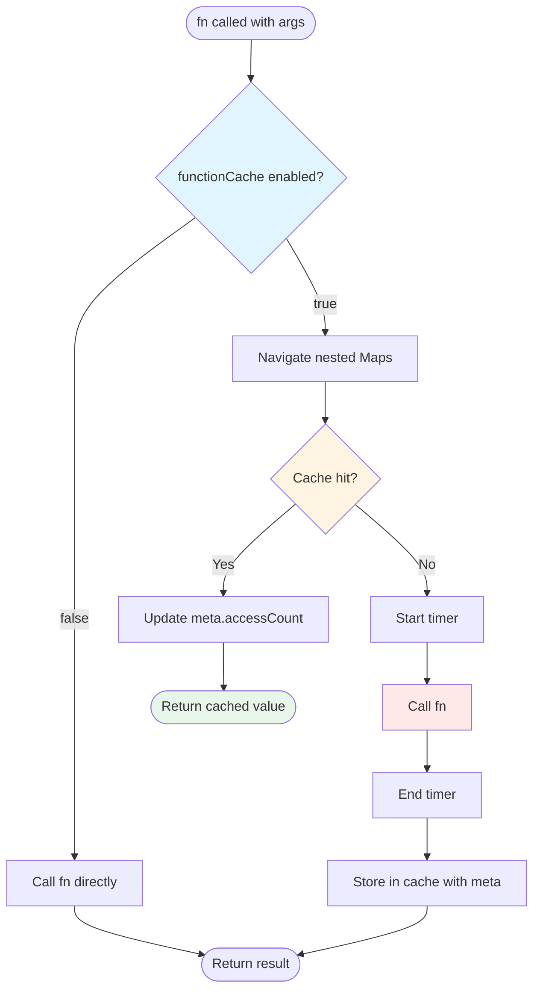
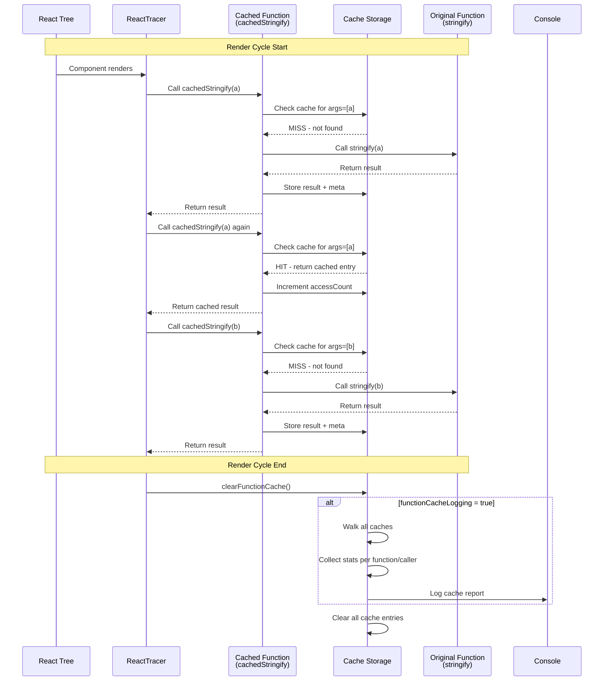

# Function Cache Design Specification

## Overview

A higher-order caching function that memoizes computation results based on parameter combinations. The cache is cleared after each render cycle, making it a **per-render memoization** system.

## Use Cases

### Primary: Eliminate Redundant Serialization

**Problem**: Functions like `stringify()` are called repeatedly with identical arguments during a single render cycle.

**Example from `matchUniqueValue`**:
```typescript
// Called once per label, per hook resolution
for (const label of labels) {
  const labelComparable = stringify(label.normalizedValue); // REDUNDANT!
  if (labelComparable === anchorComparable) {
    return label.label;
  }
}
```

If 5 components each resolve 3 hooks, and each component has 5 labels:
- `stringify(label.normalizedValue)` called: 5 × 3 × 5 = **75 times**
- But there are only **5 unique `normalizedValue` instances** (one per label)
- **Redundant work**: 70 unnecessary serializations per render!

### Secondary: Performance Profiling

When `functionCacheLogging` is enabled, the cache tracks:
- First computation time (how expensive is this operation?)
- Access count (how many times is this reused?)
- Cache hit rate (how effective is caching?)

## Architecture

### Cache Structure

```typescript
interface CacheEntry<T> {
  value: T;
  meta?: {
    functionName: string;        // For logging (e.g., "stringify")
    args: unknown[];             // For logging (e.g., [normalizedValue])
    firstComputeTimeMs: number;  // GLOBAL: Time for first computation
    callerAccess: Map<string, number>;  // PER-CALLER: Access count by caller name
  };
}

// Type-safe nested Map structure that supports arbitrary arity
type NestedMap<Keys extends readonly unknown[], Leaf> =
  Keys extends readonly [infer K, ...infer Rest]
    ? Map<K, NestedMap<Rest, Leaf>>
    : Leaf;

// Cache structure for a specific function signature
type CacheFor<TArgs extends unknown[], TResult> =
  NestedMap<TArgs, CacheEntry<TResult>>;

// Global cache: Function reference → nested argument Maps
const globalCache = new Map<Function, Map<unknown, unknown>>();
```

**Rationale**:
- **Function reference as key**: Each function gets one global cache (no name collisions)
- **Nested Maps**: O(1) lookup per argument level
- **Reference equality**: Perfect for object instances like `normalizedValue`
- **Type-safe**: Structure adapts to function arity at compile time
- **Cross-caller sharing**: Same function+args cached once, used everywhere
- **Metadata for logging**: `functionName`, `caller`, `args` only for human-readable output

### Data Flow



### Lifecycle Integration



## API Design

### Core Function

```typescript
/**
 * Wraps a function with per-render caching.
 * Cache is GLOBAL per function reference, shared across all callers.
 * Cache is cleared after each render cycle.
 * Settings are read from global ReactTracerOptions (not passed as parameters).
 *
 * @param functionName - Name of the function (for logging only, e.g., "stringify")
 * @param caller - Name of the calling context (for logging only, e.g., "matchUniqueValue")
 * @param fn - The function to cache (used as cache key via reference equality)
 * @returns Cached version of the function
 */
export function withCache<TArgs extends unknown[], TResult>(
  functionName: string,
  caller: string,
  fn: (...args: TArgs) => TResult
): (...args: TArgs) => TResult;
```

**Implementation sketch:**

```typescript
export function withCache<TArgs extends unknown[], TResult>(
  functionName: string,
  caller: string,
  fn: (...args: TArgs) => TResult
): (...args: TArgs) => TResult {
  // Get or create cache for THIS function reference
  let cache = globalCache.get(fn) as CacheFor<TArgs, TResult> | undefined;
  if (!cache) {
    cache = new Map() as CacheFor<TArgs, TResult>;
    globalCache.set(fn, cache);
  }

  function get(args: TArgs): CacheEntry<TResult> | undefined {
    let node: any = cache;
    for (const arg of args) {
      if (!(node instanceof Map)) return undefined;
      node = node.get(arg);
      if (node === undefined) return undefined;
    }
    return node instanceof Map ? undefined : node;
  }

  function set(args: TArgs, entry: CacheEntry<TResult>) {
    let node: any = cache;
    for (let i = 0; i < args.length - 1; i++) {
      const key = args[i];
      let next = node.get(key);
      if (!(next instanceof Map)) {
        next = new Map();
        node.set(key, next);
      }
      node = next;
    }
    node.set(args[args.length - 1], entry);
  }

  return (...args: TArgs): TResult => {
    // Read settings from globalState
    if (!traceOptions.functionCache) {
      return fn(...args); // Zero overhead when disabled
    }

    const hit = get(args);
    if (hit) {
      if (traceOptions.functionCacheLogging && hit.meta) {
        const currentCount = hit.meta.callerAccess.get(caller) || 0;
        hit.meta.callerAccess.set(caller, currentCount + 1);
      }
      return hit.value;
    }

    const t0 = traceOptions.functionCacheLogging ? performance.now() : 0;
    const value = fn(...args);

    const callerAccess = new Map<string, number>();
    callerAccess.set(caller, 1);

    const entry: CacheEntry<TResult> = {
      value,
      meta: traceOptions.functionCacheLogging ? {
        functionName,
        args,
        firstComputeTimeMs: performance.now() - t0,
        callerAccess,
      } : undefined
    };

    set(args, entry);
    return value;
  };
}
```

### Usage Example

```typescript
// In matchUniqueValue.ts
import { withCache } from './functionCache';
import { stringify } from './stringify';

// Create cached version (done once at module load)
const cachedStringify = withCache(
  "stringify",           // Function name for logging
  "matchUniqueValue",    // Caller context for logging
  stringify              // Function reference (cache key)
);

// Use cached version
export function matchUniqueValue(anchorValue: unknown, labels: LabelEntry[]): string | null {
  const anchorComparable = toComparableString(anchorValue);

  for (const label of labels) {
    // Cache lookup by function reference + args
    const labelComparable = cachedStringify(label.normalizedValue);
    if (labelComparable === anchorComparable) {
      return label.label;
    }
  }
  return null;
}
```

```typescript
// In toComparableString.ts
import { withCache } from './functionCache';
import { stringify } from './stringify';

// SAME function reference, different caller
const cachedStringify = withCache(
  "stringify",
  "toComparableString",
  stringify              // SAME reference → SHARES CACHE with matchUniqueValue!
);

export function toComparableString(value: unknown): string {
  const normalized = normalizeValue(value);
  return cachedStringify(normalized); // Benefits from cache populated by other callers
}
```

**Key Benefit**: If `matchUniqueValue` calls `stringify(obj)`, then later `toComparableString` calls `stringify(obj)` with the same object reference, it's a cache hit even though they're different callers!

### Cache Management

```typescript
/**
 * Clears the global function cache and optionally logs statistics.
 * Called after each render cycle by ReactTracer.
 */
export function clearFunctionCache(): void;

/**
 * Logs detailed per-argument-combination statistics to console.
 * Shows each unique argument combination, hit count, computation time,
 * and calculated "time if uncached" (hits × time).
 * Only called if functionCacheLogging is true.
 */
function logCacheStats(): void;
```

**Global Cache Pattern:**

The `globalCache` maps function references to their nested argument Maps. When `clearFunctionCache()` is called:
1. If `functionCacheLogging` is enabled, iterate through `globalCache`
2. For each function's cache, walk the nested Map structure to extract entries
3. Group entries by `functionName` and `caller` (from metadata)
4. Calculate metrics:
   - **Hits**: `entry.meta.accessCount`
   - **Time**: `entry.meta.firstComputeTimeMs`
   - **Time if uncached**: `Hits × Time` (shows time saved by caching)
5. Log per-function, per-caller, per-argument-combination statistics
6. Clear all caches: `globalCache.clear()`

This approach provides:
- **One cache per function reference** (no name collisions)
- **Cross-caller sharing** (same function+args reused everywhere)
- **Detailed logging** (metadata shows which callers benefited)
- **Automatic deduplication** (same function = same cache automatically)

## Configuration Options

### `functionCache` (default: `false`)

**Type**: `boolean`

**Purpose**: Enable/disable caching behavior.

**When `false`**:
- Functions are called directly, no caching overhead
- Zero performance impact
- Default for production

**When `true`**:
- Results are memoized per render cycle
- Can significantly reduce redundant computation
- Minimal memory overhead (cleared each render)

### `functionCacheLogging` (default: `false`)

**Type**: `boolean`

**Purpose**: Enable cache performance metrics.

**When `false`**:
- No metadata tracking
- Minimal memory per cache entry (just the value)

**When `true`**:
- Tracks first computation time
- Tracks access count
- Logs summary after each render
- Useful for debugging and optimization

**Requires**: `functionCache: true`

## Cache Report Format

When `functionCacheLogging` is enabled, output after each render shows **per-argument-combination statistics**:

```
[auto-tracer] Function Cache Report (Render Cycle #42):

stringify:
  Arguments: [] (computed in 0.10ms)
    matchUniqueValue: 15 hits (saved 1.40ms)
    toComparableString: 8 hits (saved 0.70ms)
    Total: 23 hits, saved 2.10ms

  Arguments: {"id":1,"name":"test"} (computed in 0.15ms)
    matchUniqueValue: 12 hits (saved 1.65ms)
    areValuesIdentical: 5 hits (saved 0.60ms)
    Total: 17 hits, saved 2.25ms

  Arguments: [1,2,3] (computed in 0.05ms)
    matchUniqueValue: 8 hits (saved 0.35ms)
    Total: 8 hits, saved 0.35ms

  Arguments: {"nested":{"deep":"value"}} (computed in 0.25ms)
    matchUniqueValue: 3 hits (saved 0.50ms)
    Total: 3 hits, saved 0.50ms

  Overall: 4 unique argument combinations, 51 total hits, 5.20ms saved

normalizeValue:
  Arguments: {"id":1} (computed in 0.08ms)
    createLabelEntry: 4 hits (saved 0.24ms)
    areValuesIdentical: 2 hits (saved 0.08ms)
    Total: 6 hits, saved 0.32ms

  Arguments: [1,2,3] (computed in 0.06ms)
    toComparableString: 4 hits (saved 0.18ms)
    Total: 4 hits, saved 0.18ms

  Overall: 2 unique argument combinations, 10 total hits, 0.50ms saved

equals:
  Arguments: 2, "hello", [Object object] (computed in 0.13ms)
    areValuesIdentical: 3 hits (saved 0.26ms)
    Total: 3 hits, saved 0.26ms

  Arguments: [], [] (computed in 0.08ms)
    areValuesIdentical: 5 hits (saved 0.32ms)
    Total: 5 hits, saved 0.32ms

  Overall: 2 unique argument combinations, 8 total hits, 0.58ms saved

Grand Total: 8 unique argument combinations across all functions
Total time saved by caching: 6.28ms (would have been 10.75ms without cache)
Cache efficiency: 58.4%
```

**Format Structure:**
- **Function name**: Top-level grouping (e.g., "stringify:")
- **Arguments header**: Shows the argument combination and computation time (GLOBAL)
  - Format: `Arguments: <stringified args> (computed in <time>ms)`
- **Per-caller rows**: Indented list showing each caller's access count
  - Format: `<caller name>: <hits> hits (saved <time saved>ms)`
  - Time saved = `(hits - 1) × computation time` (excludes first computation)
- **Total row**: Summary for this argument combination across all callers
- **Overall**: Function-level summary of all argument combinations

**Key Insights from Hierarchical Logging:**
- **Computation cost**: Each argument combination shows its one-time computation cost
- **Cross-caller sharing**: See which callers benefit from the same cached value
- **Per-caller impact**: Time saved shown separately for each caller using this argument combo
- **Hot spots**: High hit count + high computation time = biggest caching win
- **Cache effectiveness**: Many unique args with few hits per caller = poor cache reuse
- **Reference equality verification**: Same args with multiple callers confirms cross-caller sharing works

## Implementation Considerations

### Arbitrary Arity Support

**With `NestedMap` type**: No artificial arity limit needed!

```typescript
type NestedMap<Keys extends readonly unknown[], Leaf> =
  Keys extends readonly [infer K, ...infer Rest]
    ? Map<K, NestedMap<Rest, Leaf>>
    : Leaf;
```

This recursive type handles any arity:
- `stringify(value)` → arity 1: `Map<unknown, CacheEntry<string>>`
- `equals(a, b)` → arity 2: `Map<unknown, Map<unknown, CacheEntry<boolean>>>`
- `normalizeValueDeep(value, visited, depth)` → arity 3: `Map<unknown, Map<unknown, Map<unknown, CacheEntry<...>>>>`
- And so on...

**Runtime handling**: The `get()` and `set()` functions loop through `args.length` levels dynamically, so they naturally support any arity without special cases.

### Key Equality

**Maps use reference equality** for object keys:
```typescript
const cache = new Map();
const obj1 = { id: 1 };
const obj2 = { id: 1 };

cache.set(obj1, "result1");
cache.get(obj2); // undefined (different reference!)
```

**This is correct for our use case**:
- `label.normalizedValue` is the **same object instance** across multiple calls
- Reference equality = perfect cache key
- Structural equality not needed (and would be expensive)

### Memory Management

**Per-render cache size**: Bounded by number of unique argument combinations in a single render.

**Worst case example**:
- 100 components × 10 hooks each = 1,000 hook resolutions
- Each resolution checks 10 labels = 10,000 `stringify` calls
- But only ~100 unique `normalizedValue` instances
- Cache stores ~100 entries per render
- Cleared after render completes

**Memory per entry**: ~50-200 bytes (value + metadata)

**Total overhead**: ~5-20KB per render (negligible)

### Function Naming

**Challenge**: Getting the wrapped function's name at runtime.

**Options**:

1. **`fn.name` property** (simple but limited):
   ```typescript
   console.log(stringify.name); // "stringify"
   ```
   - ✅ Works for named functions
   - ❌ Minification breaks this
   - ❌ Arrow functions may have no name

2. **Manual labeling** (explicit but verbose):
   ```typescript
   const cachedStringify = withCache(stringify, options, "stringify");
   ```
   - ✅ Reliable
   - ❌ Extra parameter

3. **WeakMap metadata** (complex):
   ```typescript
   const functionNames = new WeakMap<Function, string>();
   ```
   - ✅ No parameter overhead
   - ❌ Requires registration

**Recommendation**: Use `fn.name` for logging (best effort), accept that minified builds won't show names.

## Testing Strategy

### Unit Tests

```typescript
describe("withCache", () => {
  it("should return cached result on second call with same args", () => {
    let callCount = 0;
    const fn = (x: number) => { callCount++; return x * 2; };
    const cached = withCache(fn, { functionCache: true, functionCacheLogging: false });

    expect(cached(5)).toBe(10);
    expect(cached(5)).toBe(10);
    expect(callCount).toBe(1); // Only called once
  });

  it("should call function again after cache clear", () => {
    let callCount = 0;
    const fn = (x: number) => { callCount++; return x * 2; };
    const cached = withCache(fn, { functionCache: true, functionCacheLogging: false });

    cached(5);
    clearFunctionCache();
    cached(5);

    expect(callCount).toBe(2); // Called twice
  });

  it("should bypass cache when disabled", () => {
    let callCount = 0;
    const fn = (x: number) => { callCount++; return x * 2; };
    const cached = withCache(fn, { functionCache: false, functionCacheLogging: false });

    cached(5);
    cached(5);

    expect(callCount).toBe(2); // Called every time
  });
});
```

### Integration Tests

```typescript
describe("Function cache integration", () => {
  it("should reduce stringify calls in matchUniqueValue", () => {
    const stringifySpy = vi.spyOn(stringifyModule, "stringify");

    // Setup: 3 labels with same normalizedValue instances
    const labels = [
      createLabelEntry("label1", value1, 0),
      createLabelEntry("label2", value2, 1),
      createLabelEntry("label3", value1, 2), // Reuses value1
    ];

    // Act: Match 5 times
    for (let i = 0; i < 5; i++) {
      matchUniqueValue(anchorValue, labels);
    }

    // Assert: stringify called 2 times (value1 + value2), not 15 times (3 labels × 5 iterations)
    expect(stringifySpy).toHaveBeenCalledTimes(2);
  });
});
```

## Performance Impact

### Expected Gains

**Scenario**: Component with 5 labeled hooks, rendered 10 times in a render cycle.

**Before** (no cache):
- `stringify` calls: 5 labels × 5 hooks × 10 components = **250 calls**
- Time: 250 × 0.1ms = **25ms**

**After** (with cache):
- `stringify` calls: 5 unique values = **5 calls**
- Time: 5 × 0.1ms + 245 × 0.001ms (cache lookup) = **0.5ms + 0.25ms = 0.75ms**
- **Speedup**: 33x faster

### Trade-offs

| Aspect | Without Cache | With Cache |
|--------|---------------|------------|
| CPU per call | Moderate | Low (first) + Minimal (subsequent) |
| Memory | None | ~5-20KB per render |
| Complexity | Simple | Moderate |
| Predictability | High | High (cleared each render) |

## Future Enhancements

### 1. Cache Size Limits

If cache grows too large (unlikely but possible):
```typescript
const MAX_CACHE_ENTRIES = 10000;

if (cacheSize > MAX_CACHE_ENTRIES) {
  // LRU eviction or early clear
}
```

### 2. Selective Caching

Allow per-function configuration:
```typescript
const cachedStringify = withCache(stringify, {
  ...options,
  maxCacheSize: 1000,
  enableFor: "stringify" // Only cache this function
});
```

### 3. Cross-Render Persistence

For values that don't change between renders:
```typescript
const persistentCache = withCache(stringify, {
  ...options,
  clearStrategy: "manual" // Don't auto-clear
});
```

## Integration Points

### Where to Apply Caching

**High-value targets** (called frequently with repeated args):

1. **`stringify(value)`** - in `matchUniqueValue`, `toComparableString`
2. **`normalizeValue(value)`** - in `createLabelEntry`, `areValuesIdentical`
3. **`equals(a, b)`** - in `areValuesIdentical`

**Low-value targets** (not worth caching):

1. **`createLabelEntry`** - called once per label registration
2. **`buildTreeNode`** - different args every call
3. **`renderTree`** - called once per render cycle

### Module Structure

```
packages/auto-tracer-react18/src/lib/functions/
├── functionCache/
│   ├── index.ts                    # Public API exports
│   ├── withCache.ts                # Core caching wrapper
│   ├── clearFunctionCache.ts       # Cache clearing
│   ├── types/
│   │   ├── CacheEntry.ts           # Cache entry interface
│   │   └── CacheOptions.ts         # Configuration interface
│   └── internal/
│       ├── cacheStorage.ts         # Nested Map management
│       └── logCacheStats.ts        # Statistics reporting
```

## Open Questions

1. **How to access global ReactTracerOptions?**
   - Option A: Import from settings module (existing pattern?)
   - Option B: Closure capture at initialization time
   - Option C: Singleton pattern
   - **Decision needed**: What's the existing pattern in the codebase?

2. **Should cache be cleared before or after logging?**
   - Before: Stats available for logging ✅
   - After: Ensures clean slate
   - **Recommendation**: Walk cache to collect stats, log, then clear

3. **How to display object/array arguments in logs?**
   ```typescript
   // Arguments: {"id":1,"name":"test"}
   // vs
   // Arguments: [Object object]
   ```
   - Option A: Stringify first N chars (e.g., first 50 chars)
   - Option B: Show `[Object]` with type info
   - Option C: Show reference ID if available
   - **Recommendation**: Stringify with max length, truncate with "..."

4. **Should we support function naming?**
   ```typescript
   const cachedStringify = withCache(stringify); // Auto-detect "stringify"?
   const cachedStringify = withCache(stringify, "stringify"); // Explicit?
   ```
   - Auto-detect via `fn.name` (best effort, fails with minification)
   - Explicit naming parameter (verbose but reliable)
   - **Recommendation**: Auto-detect with fallback to "anonymous"

## Summary

This design provides:
- ✅ Zero-overhead when disabled (default)
- ✅ Significant performance gains when enabled
- ✅ Automatic cleanup (per-render scope)
- ✅ Optional performance insights
- ✅ Type-safe, functional approach
- ✅ Minimal memory footprint
- ✅ Simple integration (wrap existing functions)

Next steps:
1. Implement core `withCache` function
2. Add unit tests
3. Integrate with `stringify` (highest value target)
4. Measure performance impact
5. Extend to other hot-path functions if beneficial
